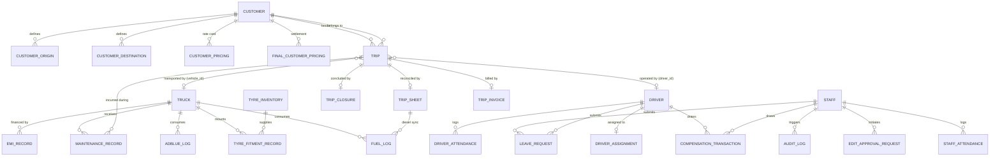

# Canaan ERP — Complete Technical & Security Documentation

**Canaan Global International — Fleet & Logistics ERP Ecosystem**  
*A comprehensive technical, architectural, and security reference covering the Backend REST API & Database, Next.js 16 Web Frontend & Electron Desktop App, and Flutter Mobile Companion Client.*

---

## Document Metadata

| Attribute | Details |
|---|---|
| **System** | Canaan Global International — Fleet & Logistics ERP |
| **Components** | FastAPI Backend · Next.js 16 Web App · Flutter Mobile Client (iOS/Android) · Electron Desktop |
| **Mobile Package** | `canaan_mobile_flutter` (Version `1.0.0+1`, Android Application ID `com.canaanglobal.erp`) |
| **Target Audience** | Software Engineers, DevOps / SRE, Security Auditors, System Administrators |
| **Last Updated** | August 2026 (Enterprise Hardening & Mobile Integration Pass) |

---

## Table of Contents

1. [Executive Summary & System Architecture](#1-executive-summary--system-architecture)
2. [Technology Stack](#2-technology-stack)
3. [Roles, Permissions & Access Control (RBAC)](#3-roles-permissions--access-control-rbac)
4. [Data Model & Entity-Relationship Architecture](#4-data-model--entity-relationship-architecture)
5. [Core Business Workflows](#5-core-business-workflows)
6. [Backend API Reference & Endpoint Catalog](#6-backend-api-reference--endpoint-catalog)
7. [Frontend Architecture (Web & Desktop)](#7-frontend-architecture-web--desktop)
8. [Mobile Client Architecture (Flutter)](#8-mobile-client-architecture-flutter)
9. [Real-Time Synchronization & Data Consistency](#9-real-time-synchronization--data-consistency)
10. [Full-Stack Security Architecture & Hardening](#10-full-stack-security-architecture--hardening)
11. [Database Migrations & Data Maintenance](#11-database-migrations--data-maintenance)
12. [Build, Release & Deployment Guide](#12-build-release--deployment-guide)
13. [API Request & Response Examples](#13-api-request--response-examples)
14. [Security Controls Matrix & Real-World Threat Scenarios](#14-security-controls-matrix--real-world-threat-scenarios)
15. [Production Readiness Checklist](#15-production-readiness-checklist)
16. [Troubleshooting & Known Limitations](#16-troubleshooting--known-limitations)
17. [Complete API Endpoint Reference](#17-complete-api-endpoint-reference)
18. [Environment Configuration Reference](#18-environment-configuration-reference)

---

## 1. Executive Summary & System Architecture

Canaan ERP is a mission-critical, trip-centric logistics enterprise system designed specifically for container transport operations (Chennai port logistics). The system manages the entire operational lifecycle: booking intake, vehicle/driver assignment, on-road tracking, trip-sheet reconciliation, accounts verification, and GST-compliant invoice generation — alongside fleet compliance, maintenance, tyre lifecycle management, fuel logging, staff/driver attendance, finance, and per-truck P&L analytics.

The system is deployed as a unified ecosystem:
1. **Backend REST API + WebSocket Server**: FastAPI (Python) serving 205 endpoints across 21 domain routers with token-guarded authentication, optimistic locking, and real-time broadcast.
2. **Relational Database**: MySQL (~40 tables, LONGBLOB document storage, automated startup migrations).
3. **Web & Desktop Frontend**: Next.js 16 (App Router) + React 19 Single Page Application, also packageable as an Electron desktop application.
4. **Mobile Companion App**: Flutter (iOS & Android) Admin client providing real-time operational monitoring, offline caching, and biometric device security.

### High-Level Ecosystem Topology

```
┌─────────────────────────────────────────────────────────────────────────────┐
│                              CLIENT LAYER                                   │
│                                                                             │
│   ┌──────────────────────────────────┐   ┌──────────────────────────────┐   │
│   │   Web / Desktop App (Next.js 16) │   │ Mobile App (Flutter 3.44.x)  │   │
│   │   - 41 App Router pages (React 19)│   │ - Admin companion client     │   │
│   │   - Electron desktop build       │   │ - Android & iOS targets      │   │
│   │   - Dynamic Dark/Light Theme     │   │ - Riverpod + GoRouter        │   │
│   │   - Client-side PDF generation   │   │ - SharedPreferences cache    │   │
│   └─────────────────┬────────────────┘   └──────────────┬───────────────┘   │
└─────────────────────┼───────────────────────────────────┼───────────────────┘
                      │ HTTPS (Bearer JWT)                │ HTTPS (Bearer JWT)
                      │ WSS /ws (Realtime hints)          │ TLS CA Pinning
                      ▼                                   ▼
┌─────────────────────────────────────────────────────────────────────────────┐
│                           BACKEND & SECURITY LAYER                          │
│                                                                             │
│   FastAPI Application (Python 3.10+, ASGI / Uvicorn)                        │
│   ├── Security & Auth Middleware (JWT HS256, In-Memory Revocation Denylist) │
│   ├── Role Guards (Admin, Commercial, Accounts, Maintenance, Docs, Yard)   │
│   ├── IP + Username Brute-Force Lockout Tracker                             │
│   ├── Real-time Broadcast Middleware (WebSocket connection registry)        │
│   ├── Magic-Byte File Validation & Secure BLOB Serving Engine               │
│   └── 21 Feature Routers (205 REST Endpoints)                               │
└──────────────────────────────────────┬──────────────────────────────────────┘
                                       │ PyMySQL / SQLAlchemy 2.0
                                       ▼
┌─────────────────────────────────────────────────────────────────────────────┐
│                              DATA STORE LAYER                               │
│                                                                             │
│   MySQL Relational Database                                                 │
│   ├── ~40 Normalized Tables (Optimistic Locking via `version` column)       │
│   ├── Document BLOB Storage (`LONGBLOB` up to 25 MB)                        │
│   ├── Append-Only Tamper-Evident Audit Trail (`audit_logs`)                 │
│   └── Startup Automated Idempotent Schema Migrations                        │
└─────────────────────────────────────────────────────────────────────────────┘
```

### Repository Layout

```
Canaan-erp-v1/
├── backend/
│   ├── main.py                     # Bootstrap, CORS, security headers, exception handlers, migrations
│   ├── models.py                   # SQLAlchemy ORM models (~40 tables)
│   ├── schemas.py                  # Pydantic request/response schemas
│   ├── security.py                 # JWT encode/decode, password policy, RBAC guards, token denylist
│   ├── audit.py                    # Append-only audit logger and client IP resolver
│   ├── database.py                 # Engine and sessionmaker setup
│   ├── websocket_manager.py        # WebSocket client registry and broadcaster
│   ├── duplicate_checks.py         # Business duplicate validation pre-insert
│   ├── excel_utils.py              # Export utilities for tabular data
│   └── routers/                    # 21 modular feature routers
├── frontend/
│   └── src/
│       ├── app/                    # Next.js App Router (41 pages across 7 domains)
│       ├── components/             # Reusable UI & feature-specific React components
│       ├── context/                # Auth, Theme, WebSocket, Notification contexts
│       ├── hooks/                  # useAutoRefresh, useIdle, and state hooks
│       └── lib/                    # Typed API client, navigation, stage configs, AI agent
├── Canaan_mobile/
│   ├── lib/
│   │   ├── main.dart               # App entry, cache init, SecurityGate mounting
│   │   ├── app.dart                # MaterialApp.router + GoRouter routing table
│   │   ├── core/                   # API client, cache, auth, theme, and security controls
│   │   ├── features/               # Feature screens and Riverpod state providers
│   │   └── shared/                 # Common widgets, utility classes, and themes
│   ├── android/                    # Android host configuration (keystore, ProGuard, MainActivity)
│   └── ios/                        # iOS host configuration (Runner, SceneDelegate, Info.plist)
└── docs/                           # Central documentation repository
```

---

## 2. Technology Stack

### Backend Stack
| Layer / Concern | Technology | Specification / Version | Rationale |
|---|---|---|---|
| **Web Framework** | FastAPI | 0.104+ (Async / ASGI) | High throughput, native OpenAPI generation, dependency injection |
| **ASGI Server** | Uvicorn / Passenger ASGI | Single-worker (`--workers 1`) | Preserves in-process lockout, broadcast, and revocation memory state |
| **ORM** | SQLAlchemy | 2.0 (Declarative Mapping) | Type safety, optimistic locking support, complex joins |
| **DB Driver** | PyMySQL + Cryptography | 1.1+ | Native Python MySQL driver supporting TLS/caching sha2 |
| **Validation** | Pydantic | 2.5+ (V2 Core) | Request payload parsing, response serialization |
| **Cryptography / Auth** | python-jose + bcrypt | HS256 / passlib | Secure JWT signing, salt-hashed password storage |
| **File Handling** | python-multipart + python-magic | Magic-byte checking | Validates file headers to prevent spoofed uploads |

### Web Frontend Stack
| Layer / Concern | Technology | Specification / Version | Rationale |
|---|---|---|---|
| **Framework** | Next.js | 16.2 (App Router) | Server-rendered shells, client-side SPA routing, React 19 compatibility |
| **UI Library** | React | 19.2 | Modern concurrent rendering, hooks, context API |
| **Language** | TypeScript | 5.x | Strict static typing across models and API clients |
| **Styling** | Tailwind CSS | v4 (CSS Variables) | Universal dark/light remapping without inline classes |
| **Icons & Charts** | Lucide React + Recharts | Latest | Standardized iconography and interactive analytics |
| **Dialogs / Alerts** | SweetAlert2 | Latest | Consistent modal and alert UX |
| **Date Handling** | date-fns + react-datepicker | Latest | Date formatting, IST timezone handling, date picker inputs |
| **Idle Detection** | react-haiku (`useIdle`) | Latest | 15-minute idle auto-logout monitoring |
| **PDF Generation** | jsPDF + html2canvas | Client-Side | Instant generation of LR consignment notes, invoices, and reports |
| **Desktop Wrapper** | Electron | Optional build | Native desktop window execution for office workstations |

### Mobile Client Stack (Flutter)
| Layer / Concern | Technology | Specification / Version | Rationale |
|---|---|---|---|
| **Framework & SDK** | Flutter / Dart | Flutter 3.44.x / Dart ^3.12.2 | Cross-platform compilation for Android & iOS |
| **State Management** | flutter_riverpod | ^2.5.1 | Declarative, compile-safe dependency and state injection |
| **Routing** | go_router | ^14.2.7 | Declarative routing with redirection guards and shell layouts |
| **Networking** | dio | ^5.7.0 | Advanced interceptor chain (TLS pinning, auth, caching, 401/403) |
| **Secure Storage** | flutter_secure_storage | ^9.2.2 | Hardware-backed KeyStore (Android) / Keychain (iOS) |
| **Local Cache** | shared_preferences | ^2.3.2 | Offline write-through fallback cache |
| **Charts** | fl_chart | ^0.69.0 | P&L and analytics visualizations |
| **Fonts** | google_fonts (Plus Jakarta Sans) | ^6.2.1 | Consistent typography |
| **Formatting** | intl | ^0.19.0 | Date/number/currency localization |
| **UI Effects** | shimmer + slide_to_act | Latest | Loading skeleton shimmer and swipe-to-confirm actions |
| **Biometric Auth** | local_auth | ^2.3.0 | Fingerprint, Face ID, and device credential prompt |
| **Root Detection** | safe_device | ^1.1.4 | Anti-tamper, jailbreak, and root detection (fail-closed) |

---

## 3. Roles, Permissions & Access Control (RBAC)

The system enforces strict Role-Based Access Control mapped directly to organizational designations. Each staff member is assigned a `software_designation` stored in their profile and encoded within their signed JWT access token. A user cannot forge or change their own role — it is embedded at login and verified server-side on every request.

### Organizational Roles Matrix

| Role (Software Designation) | Staff Representative | Functional Scope | Primary Workspaces |
|---|---|---|---|
| **Admin** | Managing Director / Owner | Full unrestricted system access, security audit log, lockout resets, edit approvals, deletions | `/`, `/admin/*`, `/insights/*`, `/attendance/*` |
| **Commercial Manager** | Kumar | Booking creation, trip & driver assignment, customer rate cards, transport pricing | `/trips/assign`, `/trips/current`, `/resources/customers` |
| **Assistant Commercial Manager** | Shibu | Trip assignment, vehicle tracking, per-trip P&L & mileage analysis, fleet master | `/trips/current`, `/trips/pnl-mileage`, `/resources/fleet` |
| **Accounts** | Sunder, Thanamani | Trip verification, invoice generation, GST/financial accounting, EMI, compensation | `/trips/verification`, `/trips/finalization`, `/finance/*`, `/insights/pl-summary` |
| **Maintenance** | Jebarson | Workshop records, tyre inventory & fitment, retreading, compliance renewals | `/maintenance/trucks`, `/maintenance/tyre-management`, `/maintenance/compliance` |
| **Trip Sheet Register (Docs)** | Latha, Siva | Trip sheet reconciliation (Docs 1 & 2), diesel logging, variance remarks, re-checking | `/trips/reconciliation`, `/maintenance/fuel-history` |
| **Yard Supervisor** | Antony | Physical trip sheet collection, driver advance verification, gate tracking | `/trips/sheet-collection` |

### Enforcement Mechanisms

1. **Backend Route Guards**:
   - Every API router requires a valid JWT via `Depends(get_current_user)`.
   - `/finance/*` and `/pl-summary` additionally enforce `require_roles("Accounts", "Admin")`.
   - Destructive operations (e.g. `DELETE /trips/{id}`) verify admin status or a valid temporary edit token.
   - `require_roles(...)` in `security.py` makes adding further per-endpoint restrictions a one-line change.
2. **Frontend Route Guards**:
   - `Sidebar.tsx` and `nav-config.ts` maintain a strict `ROLE_HREFS` map. Unauthorized menu items are pruned from the DOM.
   - On login, roles without a dashboard are redirected to their designated workspace (e.g., Yard Supervisor → `/trips/sheet-collection`, Trip Sheet Register → `/trips/reconciliation`).
3. **Mobile Client Gate**:
   - The mobile application strictly admits the `Admin` role. Non-admin logins are rejected client-side before token persistence, and rejected server-side on all admin endpoints.

---

## 4. Data Model & Entity-Relationship Architecture

The database contains ~40 normalized tables across 8 logical domains. All mutable business entities implement **Optimistic Concurrency Control** via an integer `version` column and UTC audit timestamps (`created_at`, `updated_at`).

### Domain Entity Summary

```
Administration ──┬── Branch (Operating branches, halt-day fees, compensation %)
                 │
Resource Hub ────┼── Truck (Fleet master, specs, compliance dates, document BLOBs)
                 ├── Driver (KYC, licence, Aadhaar, PAN, Form-11/ESI, credentials)
                 ├── Staff (Designation, credentials, KYC, department)
                 ├── Customer (GSTIN, GTA status, e-invoicing, Origins, Destinations, Pricing)
                 └── Vendor (Vendor master, category, GSTIN/PAN)
                 │
Trip Operations ─┼── DriverAssignment (Active driver ↔ truck pairing)
                 ├── Trip (Central hub: status, booking, cargo, route, pricing, LR)
                 ├── TripClosure (Closure snapshot, halt days, driver halt pay)
                 ├── TripSheet (Reconciliation, expenses, driver settlement, diesel JSON)
                 └── TripInvoice (Tax Invoice / Bill of Supply / Transport Memo, SAC line items)
                 │
Attendance & HR ─┼── DriverAttendance / StaffAttendance (Daily check-in/out, logs)
                 ├── DriverAttendanceRemark / DriverAttendanceLateEntryLog (2-day bypass)
                 └── LeaveRequest (Leave lifecycle with approval workflow)
                 │
Maintenance ─────┼── MaintenanceRecord (Service records linked to trucks/trips)
                 ├── FuelLog (Fuel logs synced automatically from Trip Sheets)
                 ├── AdBlueLog / AdBlueManufacturer (AdBlue consumption and vendor rates)
                 ├── TyreInventory (Stock tracking, retreading count/cost)
                 └── TyreFitmentRecord (Odometer-tracked tyre mounting and dismounting)
                 │
Finance Hub ─────┼── EmiRecord (Truck financing, monthly/daily cost derivation)
                 ├── RecurringPayment (Fixed recurring overheads and due dates)
                 ├── CompensationTransaction (Driver advances, staff salary transactions)
                 └── EditApprovalRequest (1-hour time-limited edit/delete authorization)
                 │
Config/Reference ┼── SacCode (SAC codes with GST rate, linked expense, invoice type)
                 ├── TripExpenseRate (Admin-configurable default expense rate sets)
                 ├── RepairType (Repair catalogue, default costs — 10 seeded on fresh DB)
                 └── TyreBaseRate (Base price/expected range per tyre type)
                 │
System & Audit ──┴── AuditLog (Append-only security log) & Notification (Alerts)
```

### Entity-Relationship Diagram (Mermaid)



### Architectural Data Relationship Rules
1. **Trip as the Core Decoupled Hub**: The `Trip` model holds a hard foreign key to `Customer`, but references `driver_id` and `vehicle_id` using stable string codes (`CGI-D001`, `CGI-T001`). This ensures historical trip manifests remain immutable even if a driver or truck profile is modified or archived.
2. **Automatic Diesel Synchronization**: When a `TripSheet` is saved, the backend parses its embedded `diesel_entries` JSON and automatically creates or updates corresponding entries in the `FuelLog` table tagged with `source = "Trip Sheet-{id}"`.
3. **Polymorphic Transactions**: `CompensationTransaction` and `LeaveRequest` support both staff and driver entities via polymorphic keys (`person_type` + `person_id`, `category` + `applicant_id`) — no hard foreign key to either table.
4. **Customer Children Cascade**: `CustomerOrigin`, `CustomerDestination`, `CustomerPricing`, and `FinalCustomerPricing` all cascade-delete with their parent customer.

---

## 5. Core Business Workflows

### 5.1 Six-Stage Container Trip Lifecycle

```
┌─────────────────┐     ┌─────────────────┐     ┌─────────────────┐
│ 1. ASSIGNMENT   │ ──► │ 2. EXECUTION    │ ──► │ 3. COLLECTION   │
│ Commercial Mgr  │     │ On-Road Tracking│     │ Yard Supervisor │
│ (Kumar)         │     │ Status Lifecycle│     │ (Antony)        │
└─────────────────┘     └─────────────────┘     └─────────────────┘
         │                                               │
         ▼                                               ▼
┌─────────────────┐     ┌─────────────────┐     ┌─────────────────┐
│ 6. INVOICING    │ ◄── │ 5. VERIFICATION │ ◄── │ 4. RECONCILE    │
│ Accounts Auto   │     │ Accounts        │     │ Docs / Register │
│ TM / BS / Tax   │     │ Sunder/Thanamani│     │ (Latha, Siva)   │
└─────────────────┘     └─────────────────┘     └─────────────────┘
```

#### Stage 1: Trip Booking & Assignment (Commercial Manager)
- **Container Number Format**: Rigorous regex validation requiring exactly 4 letters followed by 7 digits (`^[A-Z]{4}[0-9]{7}$`), enforced on up to 3 container slots.
- **"Self" (CGI) Operational Rules**: When billing party is "Self (CGI)", payment is locked to Credit, freight invoice type defaults to Transport Memo (no GST), driver advances are hidden, and CHA name is auto-filled with "CGI" and locked.
- **Trip Date Default**: Defaults to tomorrow when booked on the same calendar day; field remains editable.
- **Hire Amount Lock**: Hire amount is locked except for Return and Open trip types.
- **Baseline Mileage**: Baseline distance (`approx_km`) is captured at booking time to serve as the reference for downstream ±10% variance checks.
- **Lift-On/Off Rules**: Auto-populated from customer rate tables for standard containers; manual entry for Open/Shifting/Empty; forced to 0 for Coastal. Any manual edit of the lift-on amount opens a mandatory Docs remark box.
- **From/To Locations**: Predefined dropdown of 25 standard Chennai port/logistics locations, merged with customer-specific routes and booking history.

#### Stage 2: Trip Execution
- Status progresses through: `Assigned` ➔ `Started` ➔ `Loaded` ➔ `On-Transit` ➔ `Reached` ➔ `Unloaded` ➔ `Completed`.
- Live status changes trigger instant WebSocket broadcasts across all connected dispatch screens.
- Active bookings are visible on all users' dashboards until invoicing is complete.

#### Stage 3: Trip Sheet Collection (Yard Supervisor)
- Yard supervisor collects physical trip sheets upon truck return.
- Column order: Vehicle No. → Driver → Container No. → From → To.
- Validates actual cash advances issued to drivers against system booking records; records whether correct or mismatched with a corrected amount and remark.
- Records `ts_received_date` and flags missing sheets with an alert to Admin and Commercial Manager if uncollected within 24 hours.
- Date-range PDF download of collected sheet records.

#### Stage 4: Trip Sheet Reconciliation (Docs Team)
- Docs team enters start/end odometers, cargo weight, toll expenses, port pass, mamool, and diesel receipts.
- Trip sheet entry date is auto-set to today on first open and is non-editable (prevents backdating).
- **±10% KM Variance Alert**: If actual odometer distance differs from `approx_km` by more than 10%, a mandatory remark popup blocks saving until an operational explanation is entered.
- **Diesel Re-sync**: Fuel station receipts (litres, rate/litre, total) entered in the trip sheet replicate directly to the vehicle's fuel maintenance log.
- **Flag for Re-Checking**: Docs can flag ambiguous sheets, preserving draft status without forwarding to accounts.
- Corrections route through the Edit Approval flow: Docs request → Commercial Manager (Kumar) reviews → Admin approves → Docs edits.

#### Stage 5: Accounts Verification (Accounts Team)
- Accounts reviews freight income, verified driver expenses, and net profit margins.
- **Approval (Tick)**: Locks reconciliation and enables invoice generation.
- **Rejection (Cross)**: Rejection reason is recorded; trip status shifts to `rejected` with an explanatory banner displayed on the Docs dashboard. Docs raise an edit request to Kumar; on Kumar's approval, Docs edit and re-submit for verification.

#### Stage 6: Invoice & LR Consignment Generation (Accounts Team)
- **Automatic Document Determination**:
  - *Self (CGI)* ➔ **Transport Memo** (Freight + Halt only; no GST).
  - *Customer + GTA Registered* ➔ **Bill of Supply** (Freight charges under RCM; no forward GST; Accounts can add extra charges: weighment, lift-on, mamool, port pass, crane, other).
  - *Customer + Non-GTA* ➔ **Tax Invoice** (Standard forward-charge GST applied; Accounts pick chargeable items).
- **Charges Editable Only For**: Open Load (cargo classification) and Return Trip (trip category). All other types have locked rate fields.
- **Sequential Numbering**: Thread-safe running sequence per type:
  - Transport Memo: `CGI{FY}/TM{nnnn}`
  - Bill of Supply: `CGI{FY}/BS{nnnn}`
  - Tax Invoice: `CGI{FY}/T{nnnn}`
- **Immutable Dates**: Invoice dates are locked to the current operational date (IST) to prevent backdating. GST number remains editable under the Accounts role.
- **LR Generation**: Automated generation of standardized A4 Lorry Receipts (Consignment Notes) via client-side jsPDF synthesis with all trip/cargo/driver/freight details.

### 5.2 Edit & Delete Approval Protocol
To prevent unauthorized tampering with closed records, modifying sensitive data (Customers, Vendors, Bookings, Trip Sheets, Closed Trips) requires an **Edit Approval Request**:
1. Requester submits change justification via `POST /edit-approvals`.
2. Admin (or Commercial Manager for Docs-team requests) reviews in `/attendance/edit-approvals`.
3. Upon approval, the backend issues an approval token granting a strict **1-hour modification window** (`expires_at`), after which edits automatically lock.

Resource types covered: `Customer`, `Vendor`, `BookingSheet`, `TripSheet`, `TripData`, `Trip` (Edit and Delete actions).

### 5.3 Automated Compliance Expiry Warning Engine
Fleet compliance documents are continuously evaluated against proactive threshold alerts:
- **Fitness Certificate (FC)**: 30 days notice
- **National / Local Permits**: 10 days notice
- **Road Tax**: 10 days notice
- **PUC / Insurance**: 7 days notice

Alerts surface immediately on Dashboard stat widgets and trigger notifications across administrative clients.

### 5.4 Additional Feature Modules

Beyond the trip pipeline, the ERP includes:

- **Dashboard**: Role-specific KPI stats with **clickable stat cards** that open the filtered trip list for that count. Active bookings widget displayed on every role's dashboard with live status until invoicing is complete.
- **Resource Hub**: Staff, Drivers, Fleet, Customers, and Vendors masters with document upload (BLOB storage) and token-guarded image serving.
- **Attendance & HR**: Mark attendance (web/app), driver & staff attendance grids, leave requests/approvals with full approval workflow, attendance report export. Includes a **2-day late-entry lock** with reason-based bypass and a dedicated late-entry log.
- **Maintenance & Care**: Truck maintenance records, tyre management (fitment/removal with odometer tracking), tyre inventory (stock with retread lifecycle), fuel history per vehicle, AdBlue consumption logs and supplier rates.
- **Finance Hub**: Driver & staff compensation ledgers (optionally trip-linked), EMI tracking (with derived monthly/daily finance cost per truck), recurring bills with next-due tracking, compliance & renewals.
- **Insights**: **P&L Summary** (Accounts-only) with full income/expense breakdown. **Operating Cost Calculator** (fuel, tyre, finance, maintenance cost per km). Per-trip **P&L & Mileage** view for the Assistant Commercial Manager (Hire − Expense = P&L; km/L mileage).
- **Security Log** (Admin-only): Audit-trail viewer with user/IP/event filters, IST timestamps, CSV/JSON export, and pagination. Includes active login-lockout management (view and instant reset per `(IP + Username)` pair).
- **AI Assistant**: In-app natural-language ERP agent (`lib/ai/erpAgent.ts`) with a chat context and aggregate count endpoints (`/trips/ai-counts`) for querying live ERP data conversationally.
- **Exports**: 20 Excel/PDF export endpoints across all modules.
- **Backup**: On-demand database SQL dump, Excel export, and file archive backup endpoints.

---

## 6. Backend API Reference & Endpoint Catalog

The backend exposes **205 REST endpoints** distributed across 21 domain routers, plus authenticated WebSocket and health check routes.

```
/auth                  (5 endpoints)   - Login, logout, audit trail, lockout list/reset
/trips                 (28 endpoints)  - Core trip lifecycle, sheets, invoices, closures, LR
/trucks                (5 endpoints)   - Fleet master CRUD
/drivers               (8 endpoints)   - Driver master CRUD and vehicle assignments
/staff                 (5 endpoints)   - Staff master CRUD and role management
/customers             (22 endpoints)  - Customers, origin/destinations, pricing matrix
/vendors               (5 endpoints)   - Vendor master CRUD
/attendance            (23 endpoints)  - Staff/driver attendance, leave requests, late logs
/maintenance           (19 endpoints)  - Vehicle service logs, fuel logs, AdBlue records
/tyre-inventory        (6 endpoints)   - Tyre stock and retreading lifecycle
/tyre-fitment          (4 endpoints)   - Truck tyre mounting, dismounting, and swaps
/finance               (15 endpoints)  - EMI records, recurring bills, compensation (Accounts-only)
/edit-approvals        (6 endpoints)   - Edit/delete authorization workflow
/branches              (5 endpoints)   - Branch configuration
/repair-types          (4 endpoints)   - Maintenance repair catalogue
/sac-codes             (6 endpoints)   - SAC codes and GST rate mappings
/operating-costs       (2 endpoints)   - Tyre rate tables and operating calculators
/trip-expense-rates    (2 endpoints)   - Standard default trip expense rates
/dashboard             (2 endpoints)   - Role-specific aggregated KPI metrics
/pl-summary            (1 endpoint)    - Comprehensive P&L statement (Accounts-only)
/notifications         (4 endpoints)   - Notification dispatch and read receipts
/files                 (2 endpoints)   - Token-guarded document/photo upload and download
/exports               (20 endpoints)  - Tabular Excel and PDF data export endpoints
/backup                (3 endpoints)   - Database SQL, Excel, and file archive dumps
/ws                    (WebSocket)     - Real-time data change notification socket
/                      (GET)           - Public API health check
```

For the full endpoint URL listing, see **[Section 17: Complete API Endpoint Reference](#17-complete-api-endpoint-reference)**.

---

## 7. Frontend Architecture (Web & Desktop)

### 7.1 App Router Structure & Page Roles (41 Pages)

The web application is structured under the Next.js App Router (`frontend/src/app`):

| Route | Page | Primary Role(s) |
|---|---|---|
| `/login` | Login (public) | Everyone |
| `/` | Dashboard | All (role-specific content) |
| `/insights/pl-summary` | P&L Summary | Admin, Accounts |
| `/insights/operating-cost-calculator` | Operating Cost Calculator | Admin |
| `/attendance/mark` | Mark Attendance | All staff |
| `/attendance/drivers` | Driver Attendance | Admin, Commercial, Asst Commercial |
| `/attendance/staff` | Staff Attendance | Admin |
| `/attendance/leave-requests` | Leave Requests | All staff |
| `/attendance/leave-approvals` | Leave Approvals | Admin |
| `/attendance/edit-approvals` | Edit Approvals | Admin, Commercial |
| `/attendance/report` | Attendance Report | Admin |
| `/trips/assign-drivers` | Assign Drivers | Commercial, Asst Commercial |
| `/trips/assign` | Assign Trips | Commercial, Asst Commercial |
| `/trips/current` | Current Trips | Commercial, Asst Commercial |
| `/trips/completed` | Completed Trips | Commercial, Asst Commercial |
| `/trips/available` | Available Trips | Commercial |
| `/trips/sheet-collection` | Sheet Collection | Yard Supervisor |
| `/trips/reconciliation` | Trip Reconciliation | Trip Sheet Register (Docs) |
| `/trips/verification` | Verification & Invoicing | Accounts |
| `/trips/finalization` | Finalization (redirects to Verification) | Accounts |
| `/trips/history` | Trip History | Admin, Commercial, Accounts |
| `/trips/pnl-mileage` | P&L & Mileage | Asst Commercial Manager |
| `/resources/staff` | Our Staff | Admin |
| `/resources/drivers` | Our Drivers | Admin, Commercial |
| `/resources/fleet` | Our Fleet | Admin, Commercial |
| `/resources/customers` | Our Customers | Admin, Commercial, Accounts |
| `/resources/vendors` | Our Vendors | Admin |
| `/maintenance/trucks` | Truck Maintenance | Admin, Maintenance |
| `/maintenance/tyre-management` | Tyre Management | Admin, Maintenance |
| `/maintenance/tyre-inventory` | Tyre Inventory | Admin, Maintenance |
| `/maintenance/fuel-history` | Truck's Fuel History | Admin, Trip Sheet Register |
| `/maintenance/compliance` | Compliance & Renewals | Admin, Accounts |
| `/finance/driver-compensation` | Driver Compensation | Admin, Accounts |
| `/finance/staff-compensation` | Staff Compensation | Admin |
| `/finance/emi-tracking` | EMI Tracking | Admin, Accounts |
| `/finance/recurring-payments` | Recurring Payments | Admin |
| `/admin/branches` | Branch Management | Admin |
| `/admin/trip-expenses` | Trip Expenses Management | Admin |
| `/admin/repairs` | Repairs Management | Admin |
| `/admin/sac-codes` | SAC Code Management | Admin, Accounts |
| `/admin/adblue` | AdBlue Management | Admin |
| `/admin/security` | Security Log | Admin |

### 7.2 State & Context Architecture

- **`AuthContext`**: Manages user session state using `sessionStorage` (ensuring isolated per-tab sessions). Automatically triggers token revocation on logout and redirects to `/login` on any `401`.
- **`ThemeContext`**: Global theme provider remapping standard Tailwind utilities (`bg-white`, `border-gray-200`, `text-gray-900`) via CSS variables in `globals.css`. Cards automatically receive a glowing blue border and deep shadow in dark mode without per-element overrides.
- **`WebSocketContext`**: Maintains a singleton WebSocket connection with capped exponential backoff reconnects (1s→30s) and automatic 30s heartbeats.
- **`NotificationContext`**: Dispatches in-app banners for pending approvals, document expiries, and system alerts.
- **`TripWorkflowContext` / `TyreInventoryContext` / `ChatContext`**: Feature-scoped state providers.

### 7.3 Global UX Standards
- **Standardized Pagination**: Strict 10-rows-per-page pagination with frozen sticky table headers across all tabular views.
- **15-Minute Idle Auto-Logout**: Monitored by `react-haiku` (`useIdle`) in `AppShell.tsx` to automatically terminate abandoned office sessions.
- **Client-Side Document Rendering**: High-fidelity invoice, Consignment Note (LR), DAB, and report PDFs generated directly in-browser using `jsPDF` and `html2canvas`.
- **Stage Row Tinting**: All trip list tables use `lib/stage-colors.ts` for per-row color tinting that visually communicates workflow stage at a glance.

---

## 8. Mobile Client Architecture (Flutter)

The mobile companion application (`Canaan_mobile`) is tailored for executive fleet administration on Android and iOS devices. Login is restricted to the `Admin` role — enforced both client-side (before token storage) and server-side (on every API request).

### 8.1 Layered Architecture

```
┌───────────────────────────────────────────────────────────┐
│                     Presentation Layer                    │
│   lib/features/<feature>/*_screen.dart + shared/widgets   │
│   (ConsumerWidgets / ConsumerStatefulWidgets)             │
├───────────────────────────────────────────────────────────┤
│                        State Layer                        │
│   lib/features/<feature>/*_provider.dart                  │
│   (Riverpod FutureProvider / StateNotifierProvider)       │
├───────────────────────────────────────────────────────────┤
│                        Core Layer                         │
│   - api (Dio Client, Interceptors, Base URLs)             │
│   - cache (Persistent SharedPreferences Write-Through)    │
│   - auth (Session StateNotifier & Storage)                │
│   - security (TLS Pinning, App Lock, Root Gate, JWT)      │
│   - theme (AppColors, AppSpacing, Typography tokens)      │
├───────────────────────────────────────────────────────────┤
│                     Data / Backend Layer                  │
│   FastAPI REST Engine @ erpbackend.canaanglobal...com     │
└───────────────────────────────────────────────────────────┘
```

**Data-flow pattern (read):**  
`Screen` → `ref.watch(fooProvider)` → provider calls `buildApiClient().get(...)` → Dio interceptors (TLS pinning, auth header, cache, 401/403 handler) → backend → JSON → provider maps to model → screen renders `loading / error / data` states.

### 8.2 Project Structure

```
lib/
├── main.dart                     # App entry: init cache, load auth, mount SecurityGate
├── app.dart                      # MaterialApp.router + go_router routing table + shell
│
├── core/
│   ├── api/
│   │   ├── api_client.dart       # buildApiClient(): Dio + interceptors + cache
│   │   └── endpoints.dart        # Legacy helper (not used by app — safe to remove)
│   ├── auth/
│   │   └── auth_provider.dart    # AuthUser, AuthState, AuthNotifier, authProvider
│   ├── cache/
│   │   └── api_cache.dart        # Persistent GET cache (SharedPreferences-backed)
│   ├── security/
│   │   ├── security_config.dart  # Feature flags + pinned CA chain/SPKI pins
│   │   ├── secure_store.dart     # Hardened secure storage wrapper
│   │   ├── jwt.dart              # JWT decode + expiry helpers
│   │   ├── tls_pinning.dart      # CA-level certificate pinning for Dio
│   │   ├── device_integrity.dart # Root/jailbreak detection
│   │   ├── app_lock.dart         # Biometric / device-credential unlock
│   │   └── security_gate.dart    # Integrity check + biometric gate (above router)
│   └── theme/
│       ├── app_colors.dart       # Light/dark colour tokens
│       ├── app_spacing.dart      # Spacing scale (xs…x3l)
│       ├── app_text_styles.dart  # Text style tokens
│       ├── app_theme.dart        # ThemeData (light/dark)
│       └── theme_provider.dart   # ThemeMode notifier (persisted; default light)
│
├── features/                     # One folder per feature: *_screen.dart + *_provider.dart
│   ├── auth/                     # login_screen.dart
│   ├── dashboard/                # Dashboard + profile/finance/attendance-today providers
│   ├── trips/                    # Active trips, history, trip detail, sheet-tracking
│   ├── fleet/                    # Fleet list + detail sheet (compliance alerts)
│   ├── maintenance/              # Maintenance records
│   ├── attendance/               # Staff & driver attendance + reports
│   ├── pl_summary/               # Per-truck P&L
│   ├── resources/                # Drivers/Staff/Customers/Vendors (EntityListScaffold)
│   ├── alerts/                   # Edit-approval requests
│   ├── security/                 # Audit log + lockouts (Admin)
│   └── more/                     # Hub menu + theme preference
│
└── shared/
    ├── utils/date_utils.dart     # CanaanDateUtils (IST formatting/parsing)
    └── widgets/                  # Reusable UI components (see §8.5)
```

### 8.3 Riverpod State Providers

| Provider | Type | Backend Endpoint | Function |
|---|---|---|---|
| `authProvider` | `StateNotifierProvider` | `POST /auth/login` | Session manager; evaluates JWT expiry on cold boot |
| `dashboardProvider` | `FutureProvider` | `GET /dashboard/overview` | Aggregated executive KPIs |
| `profileProvider` | `FutureProvider` | `GET /auth/me` | Current admin profile |
| `financeSnapshotProvider` | `FutureProvider` | `/finance/emi`, `/finance/recurring-payments`, `/finance/compensation/*` | Parallel `Future.wait` finance snapshot |
| `attendanceTodayProvider` | `FutureProvider` | `GET /attendance/summary` | Today's attendance snapshot |
| `fleetProvider` | `FutureProvider` | `GET /trucks` | Fleet list; cache-first (5-min TTL) |
| `currentTripsProvider` | `FutureProvider` | `GET /trips?status=active` | Active on-road trips |
| `allTripsProvider` | `FutureProvider` | `GET /trips` | Complete trip manifest |
| `maintenanceProvider` | `FutureProvider` | `GET /maintenance/records` | Maintenance records |
| `attendanceProvider` | `FutureProvider.autoDispose.family` | `GET /attendance/summary` | Date-keyed staff attendance |
| `driverAttendanceProvider` | `FutureProvider.autoDispose.family` | `GET /attendance/drivers` | Date-keyed driver attendance |
| `attendanceReportProvider` | `FutureProvider.autoDispose.family` | `GET /attendance/summary` | Keyed by `category\|from\|to` |
| `plSummaryProvider` | `FutureProvider` | `GET /pl-summary` | Per-truck financial performance |
| `alertsProvider` | `FutureProvider` | `GET /edit-approvals` | Pending edit-approval requests |
| `securityLogProvider` | `FutureProvider.autoDispose.family` | `GET /auth/audit-logs` | Paginated security audit trail |
| `lockoutsProvider` | `FutureProvider` | `GET /auth/lockouts` | Active brute-force login lockouts |
| `staffListProvider` / `driversProvider` / `customersProvider` / `vendorsProvider` | `FutureProvider` | `/staff`, `/drivers`, `/customers`, `/vendors` | Resource lists |
| `themeProvider` | `StateNotifierProvider` | Local Storage | Persisted Light / Dark / System mode |
| `routerProvider` | `Provider` | — | go_router instance (rebuilds on auth change) |

### 8.4 Networking Layer

**Base URLs** (`core/api/api_client.dart`):
- REST: `https://erpbackend.canaanglobalinternational.com`
- WebSocket constant `kWsUrl` (`wss://…/ws`) defined for future real-time use.

**Timeouts**: Connect 15s · Send 30s · Receive 15s.

**Dio Interceptors (in order)**:
1. **TLS Pinning** — `applyTlsPinning(dio)` pins to the Canaan CA chain.
2. **Auth** — injects `Authorization: Bearer <token>` from `SecureStore`.
3. **401/403 Handler** — clears session (token, cached profile, API cache) and triggers router redirect to `/login`.
4. **Cache** (`_CacheInterceptor`) — write-through persistent GET cache.

### 8.5 Offline Caching Engine (`core/cache/api_cache.dart`)
1. **Write-Through Persistence**: Every successful `GET` response body is saved to device `SharedPreferences`.
2. **Offline Fallback**: Network drops or 5xx server errors immediately serve cached data tagged with a `stale` indicator.
3. **Cache-First Acceleration**: Pass `Options(extra: {'cacheFirst': true, 'cacheTtlMs': N})` to serve a cached body younger than `N` ms instantly (used by Fleet with 5-min TTL).
4. **Active Eviction**: `evictCache(path)` drops a cached entry to force fresh roundtrips (invoked on pull-to-refresh).

### 8.6 Navigation Routes (go_router)

| Route | Screen |
|---|---|
| `/login` | Login |
| `/dashboard` | Dashboard (Home tab) |
| `/trips` | Active trips (Trips tab) |
| `/history` | Trip history (History tab) |
| `/attendance/report` | Attendance report (Report tab) |
| `/more` | More hub (More tab) |
| `/alerts` | Edit-approval requests |
| `/fleet` | Fleet list |
| `/maintenance` | Maintenance records |
| `/pl-summary` | P&L summary |
| `/attendance` · `/attendance/drivers` | Staff / driver attendance |
| `/customers` · `/vendors` · `/drivers` · `/staff` | Resource lists |
| `/security` | Audit log / lockouts (Admin) |
| `/trips/sheet-tracking` | Trip-sheet tracking |

### 8.7 Shared UI Widgets

| Widget | Purpose |
|---|---|
| `main_scaffold.dart` | Bottom-nav shell (Home · Trips · History · Report · More); sets themed system nav bar |
| `entity_list_scaffold.dart` | Reusable list screen with search/loading/empty/error/retry |
| `stat_card.dart` | Dashboard stat tile |
| `trip_card.dart` | Trip row/card |
| `status_badge.dart` | Coloured status pill |
| `count_up_text.dart` | Animated number count-up |
| `animated_progress_bar.dart` / `liquid_progress.dart` | Progress visuals |
| `fade_slide_in.dart` / `scale_tap.dart` | Entrance animation + tap scale |
| `announcement_banner.dart` | Inline banner |

### 8.8 Build Configuration Knobs

| Setting | File | Default |
|---|---|---|
| Backend REST URL (`kBaseUrl`) | `core/api/api_client.dart` | `https://erpbackend.canaanglobalinternational.com` |
| WebSocket URL (`kWsUrl`) | `core/api/api_client.dart` | `wss://erpbackend.canaanglobalinternational.com/ws` |
| TLS pinning on/off (`kEnableTlsPinning`) | `core/security/security_config.dart` | `true` |
| Root/jailbreak block (`kEnableRootDetection`) | `core/security/security_config.dart` | `true` |
| Biometric lock (`kEnableBiometricLock`) | `core/security/security_config.dart` | `true` |
| Theme default | `core/theme/theme_provider.dart` | Light |

---

## 9. Real-Time Synchronization & Data Consistency

To ensure dispatchers, accounts, and field staff maintain consistent operational state, the platform implements a **Persist ➔ Broadcast ➔ Refetch** consistency pattern.

```
Client Action (POST / PUT / PATCH / DELETE)
                 │
                 ▼
     FastAPI Backend Router (DB Commit)
                 │
                 ▼
     Realtime Broadcast Middleware
                 │
                 ▼
     WebSocket Broadcast (`/ws`) ──► "data_changed" { resource: "trips" }
                 │
                 ▼
     Frontend Clients (`useAutoRefresh`)
                 │
                 ▼
     Debounced REST Re-fetch (300ms) ➔ UI State Updated
```

### Real-Time Pipeline Guarantees
1. **Zero Sensitive Payload Over WebSockets**: The WebSocket channel emits only lightweight resource change notifications (e.g. `{"event": "data_changed", "resource": "trips"}`). No business data or personal details travel over the socket frame.
2. **Authenticated Sockets**: `/ws?token=<jwt>` validates token signature, expiry, and revocation denylist upon connection. Connections without a valid token are rejected with code `1008`. Sockets automatically close with code `4001` if a token expires mid-session.
3. **Connection Cap**: The server limits concurrent WebSocket connections to 500. Excess connections receive `1013 Try Again Later`.
4. **Debounced Throttling**: Server-side broadcast debouncing (250ms per resource) and client-side hook debouncing (300ms) prevent refetch storms during bulk updates.
5. **Graceful Polling Degradation**: In environments without persistent WebSocket proxying (e.g., shared cPanel hosting), `useAutoRefresh` seamlessly falls back to 60-second polling and focus-triggered refreshes.
6. **Optimistic Locking**: Every mutable table carries a `version` column. Concurrent edits increment the version; stale writes are detected and rejected (`409 Conflict`) rather than silently overwriting live data.

---

## 10. Full-Stack Security Architecture & Hardening

Both Web and Mobile platforms enforce defense-in-depth security controls designed to safeguard logistics data, financial ledgers, and identity documents.

### 10.1 Web & Backend Security Controls

```
┌─────────────────────────────────────────────────────────────────────────────┐
│                       BACKEND SECURITY CONTROLS                             │
├─────────────────────────────────────────────────────────────────────────────┤
│ 1. JWT HS256 Token Auth (12-hour expiry, unique `jti`, fail-closed secret)   │
│ 2. Server-Side Token Revocation (Instant `jti` denylist on logout)          │
│ 3. IP + Username Lockout (5 failed attempts ➔ 15 min lock; Admin reset)     │
│ 4. Authenticated Document Access (Token-guarded `/files/...`, audit-logged) │
│ 5. Magic-Byte Upload Sniffing (File signature validation; 25 MB cap)        │
│ 6. Append-Only Tamper-Evident Audit Trail (`audit_logs` table)              │
│ 7. Constant-Time Admin Authentication (`secrets.compare_digest`)            │
│ 8. Hardened Security Headers (CSP, X-Frame-Options: DENY, HSTS opt-in)     │
│ 9. Safe Error Hygiene (Generic client errors, server-only stack traces)     │
│ 10. Per-Tab Session Isolation (sessionStorage; tab close ends session)      │
│ 11. Fail-Closed Production Config (refuses start without valid SECRET_KEY)  │
└─────────────────────────────────────────────────────────────────────────────┘
```

1. **Authenticated Document Serving**: `GET /files/{entity}/{id}/{field}` enforces token authentication (via `Authorization` header or `?token=` query parameter, the latter supporting `` tag rendering). Direct URL enumeration of Aadhaar, PAN, driving licences, or vehicle RC documents is blocked. Every sensitive download is written to `audit_logs`.
2. **Magic-Byte Content Sniffing**: Uploaded files are validated against genuine binary signatures (PDF, JPEG, PNG, WEBP, GIF). Disguised executables (e.g., `payload.exe` renamed to `doc.pdf`) are rejected. Non-image files are served with `Content-Disposition: attachment` and `Content-Security-Policy: sandbox`.
3. **Brute-Force Protection**: Login attempts are tracked against composite `(IP + Username)` keys. 5 consecutive failures lock the specific source for 15 minutes without impacting the user logging in from legitimate corporate IPs. Admin can view and instantly reset any lockout from the Security Log.
4. **Server-Side Token Revocation**: Logging out instantly places the token's `jti` into an in-memory denylist, invalidating the session across REST, WebSocket, and file download routes.
5. **Password Policy**: A strength validator (`validate_password_strength`) enforcing length, character classes, and a common-password denylist is present in `security.py` but is **currently disabled pending client confirmation**.

### 10.2 Mobile Client Security Controls

```
┌─────────────────────────────────────────────────────────────────────────────┐
│                       MOBILE SECURITY CONTROLS                              │
├─────────────────────────────────────────────────────────────────────────────┤
│ 1. CA-Level Certificate Pinning (Pinned to Let's Encrypt CA chain)          │
│ 2. Hardened OS Storage (EncryptedSharedPreferences / Keychain first_unlock) │
│ 3. Proactive + Reactive Session Expiry (Local exp check + 401/403 purge)    │
│ 4. Root / Jailbreak Detection (Fail-closed `SecurityGate` block screen)     │
│ 5. Biometric & Credential App Lock (`local_auth`, re-locks on background)   │
│ 6. Native Screen-Capture Protection (`FLAG_SECURE` / iOS privacy cover)     │
│ 7. Release Code Hardening (Android R8 Shrinking + Dart Symbol Obfuscation)  │
│ 8. Cleartext HTTP Blocked & Cloud Backups Disabled                          │
└─────────────────────────────────────────────────────────────────────────────┘
```

1. **CA-Level Certificate Pinning (`lib/core/security/tls_pinning.dart`)**:
   - Pins requests to the Let's Encrypt intermediate (`YR1`) and root (`ISRG Root YR`) Certificate Authority chain.
   - Survives standard 60-day leaf certificate renewals while blocking proxy interception (Burp Suite, mitmproxy, rogue corporate CAs).
   - Android additionally blocks user-added CAs and all cleartext HTTP via `network_security_config.xml`. iOS enforces App Transport Security (`NSAllowsArbitraryLoads = false`).
2. **Hardened Storage Wrapper (`lib/core/security/secure_store.dart`)**:
   - Android: `EncryptedSharedPreferences` backed by AES-256-GCM and Android Keystore / StrongBox.
   - iOS: Keychain configured with `kSecAttrAccessibleAfterFirstUnlockThisDeviceOnly`.
   - OS Cloud Backups and ADB device-to-device transfers are strictly disabled (`data_extraction_rules.xml`, `allowBackup="false"`).
3. **Device Integrity & Root Blocking (`lib/core/security/device_integrity.dart`)**:
   - Evaluates root binaries, test-keys, Magisk/Jailbreak hooks via `safe_device` / RootBeer.
   - Compromised devices are halted at a fail-closed, un-dismissible "Security Check Failed" screen. Android developer mode is surfaced as a soft signal only and does not block the app.
4. **Biometric Session Gate (`lib/core/security/app_lock.dart`)**:
   - Prompts for Biometric (Fingerprint/Face ID) or device PIN on launch and whenever the application returns from the background.
   - If the device has no lock screen configured, the lock is skipped gracefully (the user is never locked out of their own unprotected device).
5. **Native Screen-Capture Protection**:
   - Android: `FLAG_SECURE` enabled in `MainActivity.kt` to prevent screenshots, screen recording, and app-switcher task previews.
   - iOS: Native privacy overlay applied in `SceneDelegate.swift` on `sceneWillResignActive`; removed on `sceneDidBecomeActive`.
6. **Verifying Certificate Pinning**: On a debug device, route traffic through an intercepting proxy (Burp Suite / mitmproxy) with its CA installed on the device. With pinning active, **all API calls must fail** at the TLS handshake. If requests succeed, pinning is not active — check for the fallback warning in `tls_pinning.dart`.

### 10.3 Mobile Security Controls Summary Table

| Control | Status | Toggle | Source File |
|---|---|---|---|
| CA certificate pinning | ✅ Active | `kEnableTlsPinning` | `tls_pinning.dart` |
| Cleartext HTTP blocked | ✅ Active | manifest / plist | `network_security_config.xml`, `Info.plist` |
| Hardened secure storage | ✅ Active | always | `secure_store.dart` |
| Cloud backups disabled | ✅ Active | manifest | `AndroidManifest.xml`, `data_extraction_rules.xml` |
| Proactive JWT expiry check | ✅ Active | always | `jwt.dart`, `auth_provider.dart` |
| 401/403 reactive session kill | ✅ Active | always | `api_client.dart` |
| Root/jailbreak block | ✅ Active (fail-closed) | `kEnableRootDetection` | `device_integrity.dart` |
| Biometric app lock | ✅ Active | `kEnableBiometricLock` | `app_lock.dart` |
| Screenshot/recording block | ✅ Active | native (`FLAG_SECURE`) | `MainActivity.kt`, `SceneDelegate.swift` |
| R8 + Dart obfuscation | ✅ Active (release builds) | build config | `build.gradle.kts` |

---

## 11. Database Migrations & Data Maintenance

The database layer uses an **automated startup migration pipeline** inside `backend/main.py`:
1. **`Base.metadata.create_all()`**: Creates any missing tables on boot.
2. **`_run_schema_migrations()`**: Sequentially applies guarded `ALTER TABLE` statements inside independent transaction blocks. Missing columns, expanded enums, newly added indexes, and foreign keys are provisioned automatically without requiring external migration tooling. Each statement runs in its own transaction — failures are swallowed so a single failed migration doesn't block startup.
3. **Role-Rename Migrations**: Two state-aware rename rounds migrate legacy role names (Fleet Manager → Commercial/Assistant Commercial Manager, Finance Manager → Accounts, Tyre Manager → Maintenance, Staff → Trip Sheet Register, Yard Staff → Yard Supervisor) with data backfill and enum finalization. They detect completion and skip on already-migrated databases.
4. **BLOB Widening (`_widen_blob_columns()`)**: Automatically upgrades document columns from `MEDIUMBLOB` to `LONGBLOB` (supporting 25 MB document uploads). Runs only when a column isn't already `LONGBLOB`, so repeated restarts stay cheap.
5. **Default Seeds (`_seed_repair_types()`)**: Automatically seeds 10 default `RepairType` and expense categories on fresh database instances.

---

## 12. Build, Release & Deployment Guide

### 12.1 Backend Deployment

**Environment Configuration (`backend/.env`)**:
```ini
APP_ENV=production
DB_HOST=127.0.0.1
DB_USER=canaan_dbuser
DB_PASSWORD=SecureProductionPassword
DB_NAME=canaan_erp
SECRET_KEY=64HexCharactersGeneratedSecretKeyString
ACCESS_TOKEN_EXPIRE_HOURS=12
ADMIN_USERNAME=admin@canaanglobalinternational.com
ADMIN_PASSWORD=ComplexSuperAdminPassword
CORS_ORIGINS=https://erp.canaanglobalinternational.com
ENABLE_HSTS=1
MIN_PASSWORD_LENGTH=10
```

**Execution**: Run with Uvicorn in single-worker mode:
```bash
uvicorn main:app --host 0.0.0.0 --port 8000 --workers 1
```
> **Single-worker mode is mandatory.** The token revocation denylist, login lockout counters, and WebSocket broadcast registry all operate in-process within Python memory. Multiple workers would fragment this shared state, causing inconsistent broadcasts and revocation failures.

**cPanel / Shared Hosting (GoDaddy)**:
- A Passenger ASGI shim (`passenger_asgi.py`) serves the app when Uvicorn isn't directly available.
- WebSockets require `.htaccess` proxying:
  ```
  RewriteCond %{HTTP:Upgrade} websocket [NC]
  RewriteRule /ws(.*) ws://127.0.0.1:8000/ws$1 [P,L]
  ```
- On shared hosting without WebSocket proxying, the frontend automatically falls back to 60-second polling — the app remains fully functional.

### 12.2 Web Frontend Deployment
```bash
# Install dependencies
npm install

# Production build
npm run build

# Start production server
npm run start
```

### 12.3 Mobile Client Release Build & Signing

#### Android Release Signing Setup
Create `Canaan_mobile/android/key.properties` (git-ignored):
```properties
storePassword=YourKeystorePassword
keyPassword=YourKeyPassword
keyAlias=canaan
storeFile=canaan-release.jks
```
Place `canaan-release.jks` in `Canaan_mobile/android/app/`.

> ⚠️ **Back up `canaan-release.jks` and its password permanently.** Losing the keystore means you can never publish an update to the same Play Store listing.

**Certificate DN** (expected on release builds): `CN=Canaan, O=Canaan, L=Tuticorin, ST=Tamil Nadu, C=India`

**Verify APK signing**:
```bash
~/Library/Android/sdk/build-tools/<ver>/apksigner verify --print-certs \
  build/app/outputs/apk/release/canaan.apk
```

#### Release Compilation Commands
```bash
# Clean workspace
flutter clean && flutter pub get

# 1. Android APK (Direct install / sideloading)
flutter build apk --release --obfuscate --split-debug-info=build/symbols

# 2. Android App Bundle (Google Play Store release)
flutter build appbundle --release --obfuscate --split-debug-info=build/symbols

# 3. iOS Archive (Apple App Store / TestFlight)
flutter build ipa --release --obfuscate --split-debug-info=build/symbols
```

#### Build Artifact Paths
| Platform | Target Deliverable | Output Path |
|---|---|---|
| **Android APK** | Signed Distributable APK | `build/app/outputs/apk/release/canaan.apk` |
| **Android AAB** | Signed App Bundle (Play Store) | `build/app/outputs/bundle/release/app-release.aab` |
| **iOS IPA** | Signed App Archive | `build/ios/ipa/*.ipa` |
| **Symbols** | De-obfuscation Debug Maps | `build/symbols/` |

> Keep `build/symbols/` to de-obfuscate crash reports (matched to that specific build's obfuscation seed).

---

## 13. API Request & Response Examples

All requests (except login and health check) send `Authorization: Bearer <JWT>`. Errors return `{ "detail": "<message>" }` with the appropriate HTTP status.

### 13.1 Authentication (`POST /auth/login`)
```jsonc
// Request
{ "username": "kumar@canaanglobalinternational.com", "password": "UserPassword123" }

// 200 OK Response
{
  "access_token": "eyJhbGciOiJIUzI1NiIsInR5cCI6IkpXVCJ9...",
  "token_type": "bearer",
  "id": 4,
  "name": "Kumar",
  "email": "kumar@canaanglobalinternational.com",
  "software_designation": "Commercial Manager",
  "staff_id": "STF-1004",
  "photo_url": null
}

// 401 Unauthorized
{ "detail": "Invalid username or password" }

// 429 Too Many Requests (Lockout)
{ "detail": "Too many failed login attempts. Try again in 15 minute(s)." }
```

### 13.2 Logout (`POST /auth/logout`)
```
204 No Content
```
The token's `jti` is added to the server-side revocation denylist. All subsequent requests with that token — REST, WebSocket, and file downloads — receive `401 Unauthorized`.

### 13.3 Trip Creation (`POST /trips`)
```jsonc
// Request (abridged — full schema in schemas.py TripCreate)
{
  "booking_reference_no": "BR-2026-0450",
  "booking_created_date": "2026-08-10",
  "trip_category": "OUTSTATION",
  "customer_id": 12,
  "cargo_classification": "EXPORT",
  "container_specification": "40 FT CONTAINER",
  "container_number": "TWCU2081370",
  "origin": "Chennai Port",
  "destination": "Bangalore ICD",
  "scheduled_date": "2026-08-11",
  "driver_id": "CGI-D001",
  "vehicle_id": "CGI-T001",
  "bill_to": "CUSTOMER",
  "payment_type": "Credit",
  "approx_km": 350,
  "transport_hire_amount": 28000
}

// 201 Created Response
{
  "id": 1051,
  "trip_id": "TRP-1051",
  "status": "Assigned",
  "booking_reference_no": "BR-2026-0450",
  "verification_status": "pending",
  "is_invoiced": false,
  "trip_sheet_collected": false,
  "created_at": "2026-08-10T09:15:00Z"
}

// 422 Validation Error
{ "detail": "Container number must be 4 letters followed by 7 digits." }
```

### 13.4 Advance Trip Status (`PATCH /trips/{id}/status`)
```jsonc
// Request
{ "status": "On-Transit" }
// 200 OK → updated TripOut
```

### 13.5 Save Trip Sheet (`POST /trips/{id}/sheet`)
```jsonc
// Request (abridged)
{
  "start_km": 100500, "end_km": 100870, "total_km": 370,
  "hire_amount": 28000,
  "diesel_entries": [
    { "date": "2026-08-11", "odometer": 100500, "litres": 120,
      "costPerLitre": 92.5, "totalCost": 11100, "fuelStation": "IOC Tambaram" }
  ],
  "km_variance_remark": "Detour via Hosur due to road block",
  "port_pass_expense": 500, "lift_on_off_expense": 1200
}
// 201 Created → TripSheetOut (a FuelLog row is upserted for the trip's truck)
```

### 13.6 Accounts Verification
```jsonc
// Approve: POST /trips/{id}/verify → 200 → TripOut { "verification_status": "verified" }

// Reject: POST /trips/{id}/reject-verification
// Request
{ "reason": "Hire amount mismatch vs booking" }
// 200 → TripOut { "verification_status": "rejected", "verification_rejection_reason": "..." }
// The Docs team sees a rejection banner and can raise an edit request to Kumar.
```

### 13.7 Invoice Generation (`POST /trips/{id}/invoice`)
```jsonc
// Response (abridged)
{
  "id": 300, "trip_id": 1051,
  "invoice_no": "CGI2026-27/T0042",    // Tax Invoice sequence
  "invoice_type": "Tax Invoice",
  "invoice_date": "2026-08-10",         // today (IST), non-editable
  "gst_applicable": "Yes",
  "services": [
    { "description": "Transport charges", "sac": "996511", "amount": 28000, "gst": 5 }
  ]
}
```

### 13.8 Dashboard Overview (`GET /dashboard/overview`)
```jsonc
{
  "active_trips": 12,
  "total_trips": 1050,
  "total_drivers": 34,
  "total_staff": 11,
  "pending_leave": 2,
  "fleet_on_road": 9,
  "compliance_alerts": [
    { "truck_id": "CGI-T003", "document": "Insurance", "expires_in_days": 5 }
  ]
}
```

### 13.9 Security Audit Log (`GET /auth/audit-logs`)
```jsonc
// GET /auth/audit-logs?skip=0&limit=20&user=kumar&event=login.success
{
  "total": 342,
  "items": [
    {
      "id": 342, "event": "login.success", "outcome": "success",
      "actor_name": "Kumar", "actor_role": "Commercial Manager",
      "resource": null, "ip_address": "192.168.1.25",
      "detail": null, "created_at": "2026-08-10T03:41:00Z"
    }
  ]
}
```

### 13.10 Lockout Management
```jsonc
// GET /auth/lockouts
{ "items": [ { "ip_address": "203.0.113.9", "username": "sunder",
               "failed_attempts": 5, "locked_until_seconds": 720 } ] }

// POST /auth/lockouts/reset  { "ip_address": "203.0.113.9", "username": "sunder" }
// → 204 No Content
```

### 13.11 Standard Error Envelope
All error responses return `{ "detail": "..." }`:

| HTTP Status | Trigger Condition |
|---|---|
| **400 Bad Request** | Business validation conflict or malformed state transition |
| **401 Unauthorized** | Missing, invalid, expired, or revoked Bearer token |
| **403 Forbidden** | User software designation lacks endpoint privilege |
| **409 Conflict** | Optimistic lock concurrency failure or unique constraint clash |
| **422 Unprocessable** | Request body failed Pydantic schema validation |
| **429 Rate / Lockout** | Brute-force threshold exceeded (5 failed logins) |
| **500/503 Server Error** | Internal exception; sanitized message returned to client |

---

## 14. Security Controls Matrix & Real-World Threat Scenarios

### Complete Security Controls Matrix

| Control ID | Security Control | Implementation | Web Status | Mobile Status |
|---|---|---|---|---|
| **CRITICAL-1** | Authenticated Document Downloads | `routers/files.py`, `security.py`, `audit.py` | Active (Token Guarded + Audited) | Active |
| **HIGH-1** | Magic-Byte Upload Validation | `routers/files.py` | Active (Magic bytes sniffed) | N/A (Uploads via Web) |
| **HIGH-2** | Strict CORS Origin Whitelisting | `main.py` | Active (`CORS_ORIGINS`) | Enforced by OS |
| **HIGH-3** | Admin Backdoor Removal & Constant-Time Auth | `routers/auth.py`, `security.py` | Active (`compare_digest`) | Active |
| **MEDIUM-1** | Rate Limiting | Architecture Documented | **Removed** (Shared Office IP) | N/A |
| **MEDIUM-2** | Server-Side JWT Token Revocation | `security.py`, `routers/auth.py` | Active (Denylist) | Active |
| **MEDIUM-3** | Composite IP + Username Lockout | `routers/auth.py`, `app/admin/security` | Active | Active |
| **MEDIUM-4** | Hardened Security Headers (CSP, HSTS) | `main.py` middleware | Active (HSTS opt-in) | Active (ATS / NetSec) |
| **MEDIUM-5** | Error Sanitization & Schema Hygiene | `main.py` exception handlers | Active | Active |
| **MEDIUM-6** | Append-Only Audit Logging | `models.py`, `audit.py` | Active | Active |
| **LOW-1** | Idle Auto-Logout (15 min) | `AppShell.tsx` (`useIdle`) | Active | N/A |
| **LOW-2** | Password Complexity Enforcement | `security.py` (`validate_password_strength`) | Present — **disabled pending client confirmation** | Active |
| **MOB-1** | CA-Level TLS Certificate Pinning | `tls_pinning.dart`, `security_config.dart` | N/A | Active (YR1 + ISRG Root) |
| **MOB-2** | Hardened Hardware Storage | `secure_store.dart` | N/A | Active (Keystore/Keychain) |
| **MOB-3** | Root & Jailbreak Gate | `device_integrity.dart`, `security_gate.dart` | N/A | Active (Fail-Closed) |
| **MOB-4** | Biometric / PIN App Lock | `app_lock.dart`, `security_gate.dart` | N/A | Active (Re-locks on background) |
| **MOB-5** | Screen-Capture & Preview Protection | `MainActivity.kt`, `SceneDelegate.swift` | N/A | Active (Native FLAG_SECURE) |
| **MOB-6** | Release R8 & Dart Obfuscation | `build.gradle.kts`, Flutter Build Flags | N/A | Active |

### Real-World Threat Scenarios & Resolutions

- **Scenario A: Unauthenticated Document Scraping (CRITICAL-1)**
  - *Threat*: An external actor guesses the sequential file URL `/files/driver/15/aadhaar` to bulk-download confidential identity cards.
  - *Mitigation*: The backend requires an active JWT token. Unauthenticated requests receive `401 Unauthorized`, and every access event writes to `audit_logs`.

- **Scenario B: Executable Disguised as Profile Photo (HIGH-1)**
  - *Threat*: An attacker uploads `exploit.exe` renamed to `avatar.jpg`.
  - *Mitigation*: The server sniffs the file's raw binary magic bytes. Non-image headers are rejected immediately regardless of file extension.

- **Scenario C: Rogue CA / Proxy Interception (MOB-1)**
  - *Threat*: A compromised root certificate or corporate proxy attempts a Man-in-the-Middle attack on mobile traffic.
  - *Mitigation*: The mobile client trusts only the embedded Canaan Certificate Authority chain. Requests through untrusted proxies fail the TLS handshake before any payload is sent.

- **Scenario D: Shared Office IP Brute-Force Lockout (MEDIUM-3)**
  - *Threat*: An attacker makes 5 failed attempts against an administrator's email. Under simple IP lockouts, all 50+ staff in the office sharing that public IP would be locked out.
  - *Mitigation*: Lockouts are keyed on `(IP + Username)`. Only the attacker's specific connection is throttled; legitimate users continue working unaffected.

- **Scenario E: Abandoned Session on Shared Office Computer (LOW-1 / MEDIUM-2)**
  - *Threat*: A staff member leaves a session open on a shared computer and forgets to log out.
  - *Mitigation*: The 15-minute idle auto-logout terminates the session. If the session persists, the staff member can revoke it by logging in from their own device and clicking logout — the token is immediately invalidated server-side.

---

## 15. Production Readiness Checklist

### Web & Backend Go-Live Items
- [x] JWT authentication enforced across all 21 feature routers.
- [x] Server-side token revocation operational on `POST /auth/logout`.
- [x] Production `SECRET_KEY` (≥64 hex chars) generated and populated in `backend/.env`.
- [x] `ADMIN_PASSWORD` changed from fallback defaults to a strong production secret.
- [x] `CORS_ORIGINS` locked to explicit production domain (`https://erp.canaanglobalinternational.com`).
- [x] Document download routes verified behind token authorization.
- [x] Startup schema migrations verified on production MySQL instance.
- [x] HTTPS configured end-to-end; `ENABLE_HSTS=1` enabled.
- [x] Uvicorn running with `--workers 1` (mandatory for in-process shared state).

### Mobile Client Go-Live Items
- [x] Application ID set to `com.canaanglobal.erp` across Android and iOS configurations.
- [x] Production signing keystore (`canaan-release.jks`) generated, wired, and verified with `apksigner`.
- [x] Release APK confirmed signed with production certificate (`CN=Canaan…`).
- [x] Release builds compiled with R8 code shrinking and Dart symbol obfuscation (`--obfuscate`).
- [x] CA-level TLS certificate pinning enabled and **verified on-device using an intercepting proxy** (all API calls must fail through the proxy).
- [x] Biometric lock and root detection **verified on physical hardware** (not emulator).
- [x] Native screen-capture protection (`FLAG_SECURE`) confirmed active.
- [x] `build/symbols/` retained alongside each release build for crash de-obfuscation.

---

## 16. Troubleshooting & Known Limitations

### Common Issues & Resolutions

| Component | Symptom | Root Cause | Resolution |
|---|---|---|---|
| **Mobile** | `Namespace not specified` | Legacy Flutter plugin incompatible with AGP 8 | Update plugin to maintained fork (e.g. `safe_device`) |
| **Mobile** | Biometric prompt never appears | Device has no lock screen enrolled | Enroll a PIN/fingerprint on the device; `MainActivity` must extend `FlutterFragmentActivity` |
| **Mobile** | API calls fail after backend certificate renewal | Backend Certificate Authority chain changed | Run `openssl s_client` to retrieve new CA chain and update `security_config.dart` |
| **Mobile** | Release build: `Missing class com.google.android.play.core.**` | R8 stripping deferred-components reference | Add `-dontwarn com.google.android.play.core.**` to `proguard-rules.pro` |
| **Mobile** | KGP warning for `safe_device` | Forward-compatibility warning from Kotlin Gradle Plugin | Harmless; builds fine today — swap only if a future Flutter version actually fails |
| **Web** | WebSockets failing on cPanel / GoDaddy | Hosting proxy does not support persistent WS | Normal; `useAutoRefresh` automatically falls back to 60s polling |
| **Backend** | Broadcasts not reaching all clients | Uvicorn started with multiple worker processes | Run Uvicorn with `--workers 1` or migrate connection manager to Redis |
| **Backend** | Lockout resets on server restart | Brute-force counters are in-process memory | Expected behavior with single-worker; migrate to Redis if multi-worker scaling is needed |

### Architectural Limitations & Future Roadmap
1. **In-Memory State — Single-Worker Constraint**:
   - The token revocation denylist, login lockout counters, and WebSocket broadcast manager currently operate in-process within Python memory.
   - *Roadmap*: Provision a Redis instance to back token denylists, Pub/Sub broadcasts, and rate-limit counters when horizontally scaling the backend.
2. **Short-Lived Signed Document URLs**:
   - Files are currently served via token-guarded routes. The JWT travels as a `?token=` query parameter for `` tags — mitigated by short token expiry and server-side revocation.
   - *Roadmap*: Implement HMAC pre-signed URLs (e.g., S3/Cloud Storage presigned GET) for offloaded, time-limited direct file streaming.
3. **Multi-Factor Authentication (MFA)**:
   - *Roadmap*: Implement TOTP (Time-Based One-Time Password) second-factor authentication for administrative accounts on the web client.
4. **Secrets Management**:
   - Secrets currently live in a flat `.env` file. Validated fail-closed in production, but not rotated.
   - *Roadmap*: Migrate to a secrets manager (HashiCorp Vault / AWS Secrets Manager / GCP Secret Manager) with automatic rotation.
5. **SIEM & Audit Shipping**:
   - Audit logs are stored in the MySQL `audit_logs` table. No external SIEM shipping is currently configured.
   - *Roadmap*: Forward audit events to a centralized SIEM (e.g., Splunk, Elastic SIEM) for real-time threat monitoring and immutable log storage.
6. **XSS / sessionStorage Caveat**:
   - Auth tokens are stored in `sessionStorage` (per-tab, cleared on tab close). An XSS vulnerability could read them. React escapes output by default — avoid `dangerouslySetInnerHTML` with unsanitized user data to maintain this protection.

---

## 17. Complete API Endpoint Reference

### 17.1 Auth (`/auth`)
```
POST   /auth/login                              Public entry point
GET    /auth/audit-logs                         Admin: security audit log (filterable)
GET    /auth/lockouts                           Admin: active brute-force lockouts
POST   /auth/lockouts/reset                     Admin: reset a specific (IP + username) lockout
POST   /auth/logout                             Revoke current token (jti denylist)
```

### 17.2 Trips (`/trips`)
```
GET    /trips                                   List trips (filterable by status)
POST   /trips                                   Create / assign a trip
GET    /trips/autocomplete-values               Autocomplete for cargo/shipping fields
GET    /trips/cargo-references                  Distinct cargo reference values
GET    /trips/shipping-lines                    Distinct shipping line values
GET    /trips/ai-counts                         Aggregate counts for the AI assistant
GET    /trips/invoices/next-seq                 Next invoice running number per type
GET    /trips/{trip_id}                         Trip detail
PUT    /trips/{trip_id}                         Update trip
PATCH  /trips/{trip_id}/status                  Advance status enum
DELETE /trips/{trip_id}                         Delete trip (role-guarded)
POST   /trips/{trip_id}/close                   Record trip closure (booking sheet)
GET    /trips/{trip_id}/closure                 Fetch trip closure data
POST   /trips/{trip_id}/sheet                   Save trip sheet (syncs diesel → Fuel Log)
GET    /trips/{trip_id}/sheet                   Fetch trip sheet
PATCH  /trips/{trip_id}/lr                      Save LR / consignment-note fields
POST   /trips/{trip_id}/verify                  Accounts: approve verification
POST   /trips/{trip_id}/reject-verification     Accounts: reject → back to Docs with reason
POST   /trips/{trip_id}/resubmit-verification   Docs: re-submit after correction
POST   /trips/{trip_id}/flag                    Docs: flag for re-checking
POST   /trips/{trip_id}/recheck-flag            Docs: unflag a re-checking flag
POST   /trips/{trip_id}/verify-advance          Yard: verify driver advance (correct/mismatch)
POST   /trips/{trip_id}/collect-sheet           Yard: mark trip sheet as delivered to Docs
POST   /trips/{trip_id}/receive-sheet           Docs: mark physical sheet received
POST   /trips/{trip_id}/unmark-sheet            Yard: undo sheet delivery marking
POST   /trips/{trip_id}/flag-sheet-missing      Docs: flag physical sheet as not received
GET    /trips/{trip_id}/invoice                 Fetch saved invoice data
POST   /trips/{trip_id}/invoice                 Generate invoice (type auto-derived)
```

### 17.3 Trucks (`/trucks`)
```
GET    /trucks
POST   /trucks
GET    /trucks/{truck_id}
PUT    /trucks/{truck_id}
DELETE /trucks/{truck_id}
```

### 17.4 Drivers (`/drivers`)
```
GET    /drivers
POST   /drivers
GET    /drivers/{driver_id}
PUT    /drivers/{driver_id}
DELETE /drivers/{driver_id}
GET    /drivers/assignments/all
POST   /drivers/assignments
DELETE /drivers/assignments/{driver_id_str}
```

### 17.5 Staff (`/staff`)
```
GET    /staff
POST   /staff
GET    /staff/{staff_id}
PUT    /staff/{staff_id}
DELETE /staff/{staff_id}
```

### 17.6 Customers (`/customers`)
```
GET    /customers/destination-origin-states
GET    /customers/destination-states
GET    /customers
POST   /customers
GET    /customers/{customer_id}
PUT    /customers/{customer_id}
DELETE /customers/{customer_id}
GET    /customers/{customer_id}/origins
POST   /customers/{customer_id}/origins
DELETE /customers/{customer_id}/origins/{origin_id}
GET    /customers/{customer_id}/destinations
POST   /customers/{customer_id}/destinations
PUT    /customers/{customer_id}/destinations/{dest_id}
DELETE /customers/{customer_id}/destinations/{dest_id}
GET    /customers/{customer_id}/pricing
POST   /customers/{customer_id}/pricing
PUT    /customers/{customer_id}/pricing/{price_id}
DELETE /customers/{customer_id}/pricing/{price_id}
GET    /customers/{customer_id}/final-pricing
POST   /customers/{customer_id}/final-pricing
PUT    /customers/{customer_id}/final-pricing/{pricing_id}
DELETE /customers/{customer_id}/final-pricing/{pricing_id}
```

### 17.7 Vendors (`/vendors`)
```
GET    /vendors
POST   /vendors
GET    /vendors/{vendor_id}
PUT    /vendors/{vendor_id}
DELETE /vendors/{vendor_id}
```

### 17.8 Attendance (`/attendance`)
```
GET    /attendance/summary
GET    /attendance/latest-date
GET    /attendance/drivers
POST   /attendance/drivers
PUT    /attendance/drivers/{record_id}
GET    /attendance/drivers/late-entry-log
POST   /attendance/drivers/late-entry-log
GET    /attendance/drivers/remarks
POST   /attendance/drivers/remarks
PUT    /attendance/drivers/remarks/{remark_id}
DELETE /attendance/drivers/remarks/{remark_id}
POST   /attendance/staff/self-mark
POST   /attendance/staff/close-shift
GET    /attendance/staff/self-summary
GET    /attendance/staff
POST   /attendance/staff
PUT    /attendance/staff/{record_id}
GET    /attendance/lookup-applicant
GET    /attendance/leave-requests
POST   /attendance/leave-requests
GET    /attendance/leave-requests/{request_id}
PATCH  /attendance/leave-requests/{request_id}/approve
PATCH  /attendance/leave-requests/{request_id}/reject
```

### 17.9 Maintenance / Fuel / AdBlue / Tyres
```
GET    /maintenance/ai-counts
GET    /maintenance/records
POST   /maintenance/records
PUT    /maintenance/records/{record_id}
DELETE /maintenance/records/{record_id}
GET    /maintenance/trucks/{truck_id}/status
GET    /maintenance/status
GET    /maintenance/compliance
GET    /maintenance/fuel-logs
GET    /maintenance/fuel-stations
POST   /maintenance/fuel-logs
GET    /maintenance/trucks/{truck_id}/fuel-stats
PUT    /maintenance/fuel-logs/{log_id}
DELETE /maintenance/fuel-logs/{log_id}
GET    /maintenance/adblue-logs
POST   /maintenance/adblue-logs
PUT    /maintenance/adblue-logs/{log_id}
DELETE /maintenance/adblue-logs/{log_id}
GET    /maintenance/adblue-manufacturers
POST   /maintenance/adblue-manufacturers
PUT    /maintenance/adblue-manufacturers/{manufacturer_id}
DELETE /maintenance/adblue-manufacturers/{manufacturer_id}
GET    /tyre-inventory
GET    /tyre-inventory/available
POST   /tyre-inventory
PUT    /tyre-inventory/{tyre_id}
DELETE /tyre-inventory/{tyre_id}
GET    /tyre-inventory/{tyre_id}/history
GET    /tyre-fitment
POST   /tyre-fitment
PATCH  /tyre-fitment/{fitment_id}/remove
POST   /tyre-fitment/swap
```

### 17.10 Finance (`/finance`) — Accounts-only
```
GET    /finance/emi
POST   /finance/emi
GET    /finance/emi/{emi_id}
PUT    /finance/emi/{emi_id}
DELETE /finance/emi/{emi_id}
GET    /finance/recurring-payments
POST   /finance/recurring-payments
GET    /finance/recurring-payments/{payment_id}
PUT    /finance/recurring-payments/{payment_id}
DELETE /finance/recurring-payments/{payment_id}
GET    /finance/compensation/drivers
POST   /finance/compensation/drivers
GET    /finance/compensation/staff
POST   /finance/compensation/staff
DELETE /finance/compensation/{tx_id}
```

### 17.11 Edit Approvals (`/edit-approvals`)
```
POST   /edit-approvals
GET    /edit-approvals
GET    /edit-approvals/my-active
PATCH  /edit-approvals/{request_id}/approve
PATCH  /edit-approvals/{request_id}/reject
DELETE /edit-approvals/{request_id}
```

### 17.12 Config & Reference
```
GET    /branches
POST   /branches
GET    /branches/{branch_id}
PUT    /branches/{branch_id}
DELETE /branches/{branch_id}
GET    /repair-types
POST   /repair-types
PUT    /repair-types/{repair_type_id}
DELETE /repair-types/{repair_type_id}
GET    /sac-codes
POST   /sac-codes
PUT    /sac-codes/{sac_code_id}
PATCH  /sac-codes/{sac_code_id}/link-expense
PATCH  /sac-codes/{sac_code_id}/auto-populate
DELETE /sac-codes/{sac_code_id}
GET    /trip-expense-rates
PUT    /trip-expense-rates
GET    /operating-costs/tyre-rates
PUT    /operating-costs/tyre-rates/{tyre_type}
```

### 17.13 Dashboard, P&L, Notifications, Files, Exports, Backup
```
GET    /dashboard/overview
GET    /dashboard/trips-overview
GET    /pl-summary                                    (Accounts-only)
GET    /notifications
POST   /notifications/{notification_id}/read
POST   /notifications/read-all
GET    /notifications/reminders
POST   /files/{entity}/{entity_id}/{field}            Upload (auth-guarded, magic-byte validated)
GET    /files/{entity}/{entity_id}/{field}            Download (token required for sensitive)
GET    /backup/excel
GET    /backup/sql
GET    /backup/files
GET    /exports/branches
GET    /exports/repair-types
GET    /exports/sac-codes
GET    /exports/drivers
GET    /exports/staff
GET    /exports/trucks
GET    /exports/vendors
GET    /exports/customers
GET    /exports/trips
GET    /exports/driver-assignments
GET    /exports/driver-attendance
GET    /exports/staff-attendance
GET    /exports/leave-requests
GET    /exports/emi
GET    /exports/recurring-payments
GET    /exports/driver-compensation
GET    /exports/staff-compensation
GET    /exports/maintenance-records
GET    /exports/tyre-inventory
GET    /exports/fuel-logs
```

### 17.14 Special Routes
```
GET       /            Health check (public — used by login page "Connected" badge)
WEBSOCKET /ws?token=   Real-time data-change broadcast (JWT-authenticated)
```

---

---

## 18. Environment Configuration Reference

This section documents every environment variable consumed by the backend and web frontend. **Never commit actual secret values to version control or share them in untrusted channels.** The values shown below are placeholders — retrieve actual production values from the secure credentials store.

### 18.1 Backend (`backend/.env`)

| Variable | Example / Placeholder | Required | Description |
|---|---|---|---|
| `APP_ENV` | `production` | Yes | Set to `production` on the live server; enables fail-closed startup checks. Anything else is treated as development. |
| `DB_HOST` | `sg2plzcpnl509482.prod.sin2.secureserver.net` | Yes | MySQL host. Use `localhost` for local development. |
| `DB_USER` | `erp_admin` | Yes | MySQL username. |
| `DB_PASSWORD` | `<DB_PASSWORD>` | Yes | MySQL password. Keep complex and unique to this database. |
| `DB_NAME` | `canaan_erp_v1` | Yes | Target database / schema name. |
| `SECRET_KEY` | `<64-hex-char-random-string>` | Yes | HS256 JWT signing secret. Generate with `openssl rand -hex 32`. Rotating this key immediately invalidates **all** active user sessions. |
| `ACCESS_TOKEN_EXPIRE_HOURS` | `12` | Yes | JWT lifetime in hours. Shorter values improve security; longer values reduce re-login friction. |
| `ADMIN_USERNAME` | `admin@canaan.com` | Yes | Email address for the built-in super-admin account. |
| `ADMIN_PASSWORD` | `<ADMIN_PASSWORD>` | Yes | Password for the built-in super-admin account. Must be strong (≥16 characters, mixed case, digits, symbols). |
| `FERNET_KEY` | `<base64-fernet-key>` | Yes | Symmetric Fernet key used to encrypt the `password_plain` column for staff credentials. Generate with `from cryptography.fernet import Fernet; print(Fernet.generate_key().decode())`. Rotating requires resetting all staff passwords. |
| `MIN_PASSWORD_LENGTH` | `10` | No | Minimum password length enforced by the strength validator. Set to `0` to disable (current state — disabled pending client confirmation). |
| `CORS_ORIGINS` | `https://erp.canaanglobalinternational.com,http://localhost:3000` | Yes | Comma-separated list of allowed frontend origins. No trailing slash. Include `http://localhost:3000` only during development. |
| `ENABLE_HSTS` | `1` | No | Set to `1` to emit the `Strict-Transport-Security` header. Enable only when HTTPS is confirmed end-to-end on the production domain. |

**Full file template (`backend/.env.example`)**:
```ini
# ── DEPLOYMENT ENVIRONMENT ────────────────────────────────────────────────
APP_ENV=production

# ── DATABASE ──────────────────────────────────────────────────────────────
DB_HOST=<mysql-host>
DB_USER=<mysql-user>
DB_PASSWORD=<mysql-password>
DB_NAME=<database-name>

# ── AUTH / JWT ────────────────────────────────────────────────────────────
SECRET_KEY=<64-hex-char-secret>
ACCESS_TOKEN_EXPIRE_HOURS=12
ADMIN_USERNAME=admin@canaan.com
ADMIN_PASSWORD=<strong-admin-password>

# ── FERNET (Staff Password Encryption) ────────────────────────────────────
FERNET_KEY=<base64-fernet-key>

# ── PASSWORD POLICY ───────────────────────────────────────────────────────
MIN_PASSWORD_LENGTH=10

# ── CORS ──────────────────────────────────────────────────────────────────
CORS_ORIGINS=https://erp.canaanglobalinternational.com

# ── TRANSPORT SECURITY ────────────────────────────────────────────────────
ENABLE_HSTS=1
```

**Local development override** (comment production block, uncomment local):
```ini
DB_HOST=localhost
DB_USER=root
DB_PASSWORD=<local-dev-password>
DB_NAME=canaan
CORS_ORIGINS=https://erp.canaanglobalinternational.com,http://localhost:3000
ENABLE_HSTS=0
```

---

### 18.2 Web Frontend (`frontend/.env.local`)

| Variable | Example / Placeholder | Required | Description |
|---|---|---|---|
| `NEXT_PUBLIC_API_URL` | `https://erpbackend.canaanglobalinternational.com` | Yes | Full base URL of the FastAPI backend (no trailing slash). Switch to `http://127.0.0.1:8000` for local development. |
| `NEXT_PUBLIC_DISABLE_WEBSOCKET` | `true` | No | Set to `true` to suppress WebSocket connections and rely on polling instead. Useful for shared-hosting environments (e.g., GoDaddy cPanel) where persistent WebSocket proxying is unavailable. |
| `NEXT_PUBLIC_OR_API_KEY` | `<groq-api-key>` | Yes (AI Assistant) | Groq API key for the in-app ERP AI Assistant (Llama 3.3 70B). Obtain from [console.groq.com/keys](https://console.groq.com/keys). |
| `NEXT_PUBLIC_OR_MODEL` | `llama-3.3-70b-versatile` | Yes (AI Assistant) | Groq model identifier used by the AI Assistant. Change only to switch to a different supported Groq model. |

> **Note**: All `NEXT_PUBLIC_*` variables are bundled into the browser JavaScript at build time. Do **not** place any secret that must remain server-side (database credentials, private keys) in `NEXT_PUBLIC_*` variables.

**Full file template (`frontend/.env.local.example`)**:
```ini
# Backend API base URL (no trailing slash)
NEXT_PUBLIC_API_URL=https://erpbackend.canaanglobalinternational.com

# Set to "true" on shared hosting without WebSocket proxy support
NEXT_PUBLIC_DISABLE_WEBSOCKET=false

# ERP AI Assistant — Groq + Llama 3.3 70B
NEXT_PUBLIC_OR_API_KEY=<groq-api-key>
NEXT_PUBLIC_OR_MODEL=llama-3.3-70b-versatile
```

---

*End of Canaan ERP Unified Technical & Security Documentation.*
