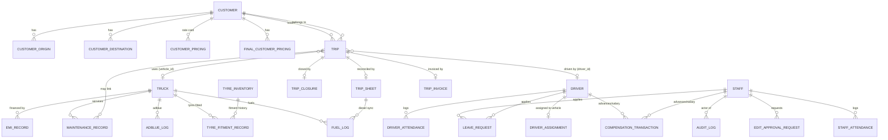

# Canaan ERP — Technical Documentation

**Canaan Global International — Fleet & Logistics ERP**
A trip-centric enterprise resource planning system for container transport operations (Chennai port logistics), covering the full lifecycle from booking a trip through driver assignment, on-road execution, trip-sheet reconciliation, accounts verification, and GST-compliant invoice generation — plus fleet maintenance, tyre/fuel tracking, HR/attendance, finance, and P&L analytics.

---

## Table of Contents

1. [System Architecture](#1-system-architecture)
2. [Technology Stack](#2-technology-stack)
3. [Roles & Access Control](#3-roles--access-control)
4. [Data Model](#4-data-model)
5. [Backend API Reference](#5-backend-api-reference)
6. [Core Trip Workflow](#6-core-trip-workflow)
7. [Feature Modules](#7-feature-modules)
8. [Frontend Architecture](#8-frontend-architecture)
9. [Real-Time & Data Consistency](#9-real-time--data-consistency)
10. [Security Architecture](#10-security-architecture)
11. [Database Migrations](#11-database-migrations)
12. [Deployment](#12-deployment)
13. [Entity-Relationship Diagram](#13-entity-relationship-diagram)
14. [Complete Endpoint Reference](#14-complete-endpoint-reference)
15. [API Request / Response Examples](#15-api-request--response-examples)
16. [Implemented Security Features (Codebase)](#16-implemented-security-features-codebase)

---

## 1. System Architecture

The application is a classic three-tier SPA + REST API + relational database:

```
┌─────────────────────────────────────────────┐
│  Frontend — Next.js 16 (App Router, React 19)│
│  - SPA served as static/SSR pages            │
│  - Also packageable as an Electron desktop app│
└───────────────┬─────────────────────────────┘
                │  HTTPS / JSON  (Bearer JWT)
                │  WebSocket /ws (realtime hints)
┌───────────────▼─────────────────────────────┐
│  Backend — FastAPI (Python)                  │
│  - 21 routers, JWT auth on every route       │
│  - SQLAlchemy ORM, Pydantic schemas          │
│  - In-process WebSocket broadcast manager    │
└───────────────┬─────────────────────────────┘
                │  PyMySQL
┌───────────────▼─────────────────────────────┐
│  Database — MySQL                            │
│  - ~40 tables, document BLOBs (LONGBLOB)     │
│  - Idempotent auto-migrations on startup     │
└─────────────────────────────────────────────┘
```

**Repository layout:**

```
Canaan-erp-v1/
├── backend/
│   ├── main.py                 # App bootstrap, middleware, migrations, router registration
│   ├── models.py               # SQLAlchemy ORM models (~40 tables)
│   ├── schemas.py              # Pydantic request/response schemas
│   ├── security.py             # JWT, password policy, role guards, token revocation
│   ├── audit.py                # Append-only audit-log helper + client IP resolver
│   ├── database.py             # Engine + session factory
│   ├── websocket_manager.py    # Connected-client registry + broadcast
│   ├── duplicate_checks.py     # Pre-insert duplicate validation
│   ├── excel_utils.py          # Excel export helpers
│   └── routers/                # 21 feature routers (see §5)
├── frontend/
│   └── src/
│       ├── app/                # Next.js App Router pages (41 pages)
│       ├── components/         # Feature-grouped React components
│       ├── context/            # React context providers (auth, theme, ws, …)
│       ├── hooks/              # Reusable hooks (useAutoRefresh, …)
│       └── lib/                # API client, nav config, helpers, AI agent
└── docs/                       # This file + SECURITY.md
```

---

## 2. Technology Stack

### Backend
| Component | Technology |
|---|---|
| Web framework | FastAPI 0.104 (ASGI, async) |
| Server | Uvicorn (single-worker); Passenger ASGI shim for shared hosting |
| ORM | SQLAlchemy 2.0 |
| DB driver | PyMySQL 1.1 (+ cryptography for secure MySQL) |
| Validation | Pydantic 2.5 |
| Auth | python-jose (JWT / HS256), passlib + bcrypt (password hashing) |
| Uploads | python-multipart |

### Frontend
| Component | Technology |
|---|---|
| Framework | Next.js 16.2 (App Router) + React 19.2 |
| Language | TypeScript |
| Styling | Tailwind CSS v4 (CSS-variable-based dark/light theming) |
| Icons | lucide-react |
| Charts | recharts |
| PDF generation | jsPDF + html2canvas (invoices, LR / consignment notes, reports) |
| Dialogs / alerts | sweetalert2 |
| Date handling | date-fns, react-datepicker |
| Hooks utilities | react-haiku (`useIdle` for idle-logout, etc.) |
| Desktop packaging | Electron (optional `electron:build`) |

---

## 3. Roles & Access Control

Seven software designations drive both backend authorization and frontend navigation. Each maps to a real person/function at Canaan.

| Role (in system) | Real function | Primary responsibility |
|---|---|---|
| **Admin** | Sir / owner | Full access to everything; approvals; security log |
| **Commercial Manager** | Kumar | Assigns trips & drivers, manages bookings, customers, P&L |
| **Assistant Commercial Manager** | Shibu | Same as Commercial Manager + per-trip P&L / mileage; truck master |
| **Accounts** | Sunder, Thanamani | Verifies trip sheets, generates invoices, finance/compliance |
| **Maintenance** | Jebarson | Truck maintenance, tyre management/inventory |
| **Trip Sheet Register** | Latha, Siva | Reconciles trip sheets (Docs 1 & 2), diesel entry, fuel log |
| **Yard Supervisor** | Antony | Collects trip sheets, verifies driver advances |

### Enforcement

- **Backend:** Every business router is registered behind `Depends(get_current_user)` (valid JWT required). Finance and P&L routers additionally require `require_roles("Accounts")`. Individual sensitive endpoints (e.g. trip delete) use `require_roles(...)` guards. Admin-only endpoints check `user.role != "Admin"`.
- **Frontend:** `Sidebar.tsx` holds a `ROLE_HREFS` map — an allow-list of routes per role (Admin = `"all"`). Navigation sections are filtered so users only see what they can use. On login, roles without a dashboard are redirected to their home workspace (Yard Supervisor → `/trips/sheet-collection`, Trip Sheet Register → `/trips/reconciliation`).

---

## 4. Data Model

~40 tables grouped by domain. All mutable entities carry a `version` column for **optimistic locking** and `created_at` / `updated_at` timestamps (Python-side UTC defaults).

### Administration
- **Branch** — operating branches; per-branch halt-day fees (20ft/40ft) and driver halt-day compensation %.

### Resource Hub
- **Truck** — full fleet master: registration, type (20/40 ft, rigid/articulated), tyre layout, fuel capacity, odometer, AdBlue consumption rate, and **compliance documents** (RC, FC, road tax, insurance, national/local permit, PUC) each with number, dates, expenses, and a stored document BLOB (LONGBLOB, 25 MB cap). Photos stored as BLOB.
- **Driver** — driver master: KYC (Aadhaar, PAN, licence + expiry), bank details, Form-11/ESI, agreement flag, login credentials, document BLOBs.
- **Staff** — internal staff: `software_designation` (the role enum), department, KYC, login credentials.
- **Customer** — customer master with GSTIN, type (Transports/Shipping), `is_gta`, e-invoice applicability. Has child tables:
  - **CustomerOrigin / CustomerDestination** — named routes; destination carries state, address, status, approx distance (km).
  - **CustomerPricing** — rate card keyed by destination × cargo classification × container type × weight band.
  - **FinalCustomerPricing** — actual vs accounts hire amounts.
- **Vendor** — vendor master with GSTIN/PAN, category, status.

### Trip & Driver Management
- **DriverAssignment** — current driver↔vehicle pairing (one active per driver).
- **Trip** — the central entity. ~90 columns spanning: status lifecycle (`Assigned → Started → Loaded → On-Transit → Reached → Unloaded → Completed / Cancelled`), booking info, customer, cargo (classification, container spec, up to 3 container numbers in `AAAA1234567` format), route (origin/destination), shipping line/vessel, vehicle/driver assignment, payment & advances (customer + driver), transport cost (hire, crossing, rate-per-ton for open load), Commercial-Manager inputs (`approx_km`, `lift_on_amount`, `cha_name`), Docs flagging, Yard advance verification, workflow state (`verification_status`: pending/verified/flagged/rejected, `is_invoiced`, `trip_sheet_collected/received`), and **LR (Lorry Receipt / Consignment Note)** fields.
- **TripClosure** — closure snapshot: shipment, assignment, route, billing, halt info (company/party halt days, driver halt compensation).
- **TripSheet** — the reconciliation document: KM (start/end/total), cargo weight, driver settlement (pay/advance/balance), a full set of **trip expenses** (port pass, weight sheet, mamool, claimable mamool, traffic/RTO, lift-on/off, crane, parking, puncture, spare parts, major repairs JSON, other), **diesel entries** (JSON: date, odometer, litres, cost/litre, station — auto-synced to Fuel Log), toll, and KM-variance remark.
- **TripInvoice** — generated invoice: number (per-type sequence), date, type (Transport Memo / Bill of Supply / Tax Invoice), bill-to, GST number, line-item `services` (JSON), bank details, GST/IGST applicability.

### Attendance & HR
- **DriverAttendance / StaffAttendance** — daily status (unique per person+date); staff have check-in/out and admin override.
- **DriverAttendanceRemark / DriverAttendanceLateEntryLog** — remarks and the 2-day late-entry lock/bypass mechanism.
- **LeaveRequest** — leave applications with approve/reject workflow, keyed by role category.

### Maintenance & Care
- **MaintenanceRecord** — per-truck service records (optionally linked to a trip).
- **FuelLog** — vehicle fuel entries (litres, price, distance, mileage, source — "Manual Log" or "Trip Sheet-{id}").
- **AdBlueLog / AdBlueManufacturer** — AdBlue consumption logs and supplier price defaults.
- **TyreInventory** — tyre stock (brand, number, size, condition new/rethreaded, retread count & cost).
- **TyreFitmentRecord** — tyre↔truck fitment history with fitted/removed odometer & date, removal remark.
- **TyreBaseRate** — admin base price/expected range per tyre type (for the operating-cost calculator).

### Config / Reference
- **SacCode** — SAC codes with GST rate, linked expense, and auto-populate invoice type.
- **TripExpenseRate** — admin-configurable default expense rate sets, each field with an "auto" flag.
- **RepairType** — repair catalogue with default cost (seeded with 10 defaults on first boot).

### Finance Hub
- **EmiRecord** — truck loan EMIs with monthly/daily finance cost derivation.
- **RecurringPayment** — recurring bills (monthly/quarterly/yearly) with next-due tracking.
- **CompensationTransaction** — driver/staff advances & salary transactions (optionally trip-linked).
- **EditApprovalRequest** — the edit/delete approval workflow (see §7); resource types Customer/Vendor/BookingSheet/TripSheet/TripData/Trip, Edit/Delete action, 1-hour approval window.

### System
- **Notification** — persisted notifications (event type, target roles, read flag).
- **AuditLog** — **append-only** security trail: event, outcome, actor, resource, IP, user-agent, detail, timestamp. Never updated or deleted.

---

## 5. Backend API Reference

All routers mount under the FastAPI app. Each is protected by JWT unless noted.

| Prefix | Router | Endpoints | Purpose |
|---|---|---:|---|
| `/auth` | auth.py | 5 | Login, audit-logs, lockouts (list/reset), logout. **Public login.** |
| `/files` | files.py | 2 | Document/photo serving & upload (auth-guarded). |
| `/trucks` | trucks.py | 5 | Truck master CRUD. |
| `/drivers` | drivers.py | 8 | Driver master CRUD + assignments. |
| `/staff` | staff.py | 5 | Staff master CRUD + credentials. |
| `/customers` | customers.py | 22 | Customer, origins, destinations, pricing CRUD. |
| `/vendors` | vendors.py | 5 | Vendor master CRUD. |
| `/trips` | trips.py | 28 | **Core trip lifecycle** (see §6). |
| `/attendance` | attendance.py | 23 | Driver/staff attendance, leave, edit approvals. |
| `/maintenance` | maintenance.py | 32 | Maintenance, fuel, AdBlue, tyre inventory & fitment. |
| `/finance` | finance.py | 15 | EMI, recurring payments, compensation. **Accounts-only.** |
| `/dashboard` | dashboard.py | 2 | Aggregated dashboard stats. |
| `/branches` | branches.py | 5 | Branch config. |
| `/repair-types` | repair_types.py | 4 | Repair catalogue. |
| `/sac-codes` | sac_codes.py | 6 | SAC code management. |
| `/pl-summary` | pl_summary.py | 1 | P&L summary. **Accounts-only.** |
| `/exports` | exports.py | 20 | Excel/PDF exports across modules. |
| `/edit-approvals` | edit_approvals.py | 6 | Edit/delete approval workflow. |
| `/notifications` | notifications.py | 4 | Notification list/read. |
| `/trip-expense-rates` | trip_expense_rates.py | 2 | Default expense rate sets. |
| `/backup` | backup.py | 3 | Database backup/export. |
| `/operating-costs` | operating_costs.py | 2 | Operating-cost calculator inputs. |

### Key trip endpoints (`/trips`)

| Method & path | Purpose |
|---|---|
| `GET /trips` | List trips (filterable). |
| `POST /trips` | Create/assign a trip. |
| `GET /trips/{id}` | Trip detail. |
| `PUT /trips/{id}` | Update trip. |
| `PATCH /trips/{id}/status` | Advance status. |
| `DELETE /trips/{id}` | Delete (role-guarded). |
| `POST /trips/{id}/close` | Record trip closure. |
| `POST /trips/{id}/sheet` | Save trip sheet (syncs diesel → Fuel Log). |
| `GET /trips/{id}/sheet` | Fetch trip sheet. |
| `PATCH /trips/{id}/lr` | Save LR / consignment-note fields. |
| `POST /trips/{id}/verify` | Accounts approves verification. |
| `POST /trips/{id}/reject-verification` | Accounts rejects → back to Docs with reason. |
| `POST /trips/{id}/resubmit-verification` | Docs re-submit after fix. |
| `POST /trips/{id}/flag` / `/recheck-flag` | Docs flag for re-checking. |
| `POST /trips/{id}/verify-advance` | Yard verifies driver advance. |
| `POST /trips/{id}/collect-sheet` / `unmark-sheet` | Yard sheet collection state. |
| `GET /trips/invoices/next-seq` | Next invoice running number per type. |
| `GET /trips/ai-counts` | Aggregate counts for the AI assistant. |

---

## 6. Core Trip Workflow

The system is organized around a container trip moving through role-gated stages:

```
 ┌──────────────┐   ┌───────────────┐   ┌─────────────────┐   ┌──────────────┐   ┌───────────────────┐   ┌──────────────┐
 │ 1. ASSIGN    │→ │ 2. Complete     │→ │ 3. SHEET COLLECT │→ │ 4. RECONCILE │→ │ 5. VERIFY (Accts) │→ │ 6. INVOICE   │
 │ Commercial   │   │ Commercial Mgr │   │ Yard Supervisor  │   │ Docs (Latha, │   │ Sunder/Thanamani  │   │ Auto by      │
 │ Mgr (Kumar)  │   │ (Kumar)        │   │ (Antony)         │   │ Siva)        │   │ approve / reject│   │ billing party│
 └──────────────┘   └───────────────┘   └─────────────────┘   └──────────────┘   └───────────────────┘   └──────────────┘
```

**1. Trip Assignment (Commercial Manager — Kumar)**
- Container number validation: exactly 4 letters + 7 digits (`AAAA1234567`), on all 3 container fields.
- "Self" (CGI) customer logic: billing frozen, payment forced to Credit, invoice type = Transport Memo (no GST), advances hidden, CHA auto-set to "CGI" and locked.
- Trip date defaults to **tomorrow** when booked same-day.
- Hire amount locked except for Return/Open trip types.
- `approx_km` captured as baseline for the ±10% variance check downstream.
- Lift-on rules: auto from rate table for standard types; manual for Shifting/Empty/Open; forced 0 for Coastal; edits open a mandatory Docs remark.
- From/To are predefined dropdowns (25 standard Chennai port/logistics locations merged with customer-specific + history).

**2. Complete** — driver/vehicle progress the status enum; active bookings are visible on **all** users' dashboards until invoiced.

**3. Sheet Collection (Yard Supervisor — Antony)**
- Column order: Vehicle → Driver → Container → From → To.
- Driver-advance verification (correct / incorrect → remark + corrected amount).
- "TS Received" / "TS Delivered" dates shown prominently.
- Date-range PDF download; popup if a received sheet isn't entered within 1 day.
- Sticky headers, 10 per page.

**4. Reconciliation (Trip Sheet Register — Latha, Siva)**
- "Flag for Re-checking" toggle keeps a trip pending.
- Trip-sheet-entered date auto-set on first open, non-editable (no backdating).
- **Diesel entry** (litres, rate, total) after the KM section → auto-replicates to the **Fuel Log** (vehicle-wise).
- ±10% KM variance vs `approx_km` triggers a mandatory-remark popup before save.
- Corrections route through the Edit Approval flow to Kumar → Admin.

**5. Accounts Verification (Sunder / Thanamani)**
- Tick / cross selection per trip row.
- Tick → proceed to invoice generation.
- Cross → reason box; trip is rejected back to Docs (`verification_status = rejected`, reason shown as a banner). Docs then raise an edit request to Kumar; on approval, edit & re-submit.

**6. Invoice Generation (automated by billing party)**
- **Self (CGI)** → Transport Memo, no GST (freight + halt only).
- **Customer + GTA** → Bill of Supply, no GST; Accounts add extra charges (weighment, lift-on, mamool, etc.); Consignee not selectable.
- **Customer + non-GTA** → Tax Invoice with GST; Accounts pick chargeable items.
- Charges editable only for Open Load / Return Trip.
- Separate running numbers: Transport Memo `CGI{FY}/TM{nnnn}`, Bill of Supply `CGI{FY}/BS{nnnn}`, Tax Invoice `CGI{FY}/T{nnnn}`.
- Invoice date auto-set to today (IST), non-editable — no backdating. GST number editable under Accounts.
- **LR / Consignment Note**: generated per trip as an A4 PDF (jsPDF) with all trip/cargo/driver/freight details.

---

## 7. Feature Modules

Beyond the trip pipeline, the ERP includes:

- **Dashboard** — role-specific stats; **clickable stat cards** open the filtered trip list; active bookings widget on every role's dashboard.
- **Resource Hub** — Staff, Drivers, Fleet, Customers, Vendors masters with document upload (BLOB storage) and image serving.
- **Attendance & HR** — mark attendance (web/app), driver & staff attendance grids, leave requests/approvals, attendance reports, a 2-day late-entry lock with reason-based bypass, and edit approvals.
- **Maintenance & Care** — truck maintenance records, tyre management (fitment/removal with odometer tracking), tyre inventory (retread lifecycle), fuel history, AdBlue management.
- **Finance Hub** — driver & staff compensation ledgers, EMI tracking (with derived monthly/daily finance cost), recurring payments, compliance & renewals.
- **Insights** — **P&L Summary** (Accounts-only) and **Operating Cost Calculator** (fuel, tyre, finance, maintenance cost per km). Per-trip **P&L & Mileage** view for the Assistant Commercial Manager (Hire − Expense = P&L; km/L mileage).
- **Truck Compliance Alerts** — per-document expiry thresholds fire dashboard/fleet popups: FC 30 days, National/Local Permit 10 days, PUC 7 days, Road Tax 10 days, Insurance 7 days.
- **Edit/Delete Approval Workflow** (`EditApprovalRequest`) — staff request an edit or delete with a reason; Admin (or Commercial Manager for Docs rejections) approves/denies; approval grants a **1-hour** editing window (`expires_at`). Covers Customer, Vendor, Booking, Trip Sheet, Trip Data, and Trip deletes.
- **Security Log** (Admin-only) — audit-trail viewer with user/IP/event filters, IST timestamps, CSV/JSON export, pagination; plus active login-lockout management (view + instant reset). See §10.
- **AI Assistant** — an in-app agent (`lib/ai/erpAgent.ts`, `page-agent`) with a chat context and aggregate count endpoints (`/trips/ai-counts`) for natural-language queries over ERP data.
- **Exports** — 20 Excel/PDF export endpoints across modules.
- **Backup** — database backup/export endpoints.

---

## 8. Frontend Architecture

- **App Router** (`src/app`) — 41 pages, grouped by domain (`trips/`, `attendance/`, `maintenance/`, `finance/`, `resources/`, `admin/`, `insights/`). `page.tsx` at root is the dashboard; `/login` is public.
- **Components** (`src/components`) — feature-grouped (ai, attendance, branches, compensation, customers, dashboard, drivers, finance, fleet, invoices, layout, maintenance, staff, trips, tyre-inventory, ui, vendors).
- **Context providers** (`src/context`):
  - `AuthContext` — per-tab session (sessionStorage), login/logout, role-based redirects, server-side token revocation on logout.
  - `ThemeContext` — light/dark + font-size via CSS-variable remapping.
  - `WebSocketContext` — shared WS connection with reconnect + retry cap.
  - `NotificationContext` — polls + WS-driven notification/reminder feed.
  - `TripWorkflowContext`, `TyreInventoryContext`, `ChatContext` — feature state.
- **Hooks** (`src/hooks`) — `useAutoRefresh` (WS-first refresh with polling fallback), etc.
- **lib** (`src/lib`) — `api.ts` (typed API client), `nav-config.ts` (sidebar/topnav), stage-colors, AI agent, helpers.
- **Theming** — Tailwind v4 with a global CSS remapping strategy: standard utility classes (`bg-white`, `bg-gray-50`, `border-gray-200`) are remapped in `globals.css` for dark mode, so pages avoid per-element `dark:` overrides. Cards get a glowing blue border and deep shadow in dark mode automatically.
- **Global UX standards** — 10-rows-per-page pagination and sticky/frozen headers across all trip list screens; 15-minute idle auto-logout (`useIdle`).
- **PDF generation** — invoices, LR/consignment notes, and reports rendered client-side via jsPDF/html2canvas.
- **Desktop** — the same frontend can be built into an Electron desktop app.

---

## 9. Real-Time & Data Consistency

**Data-consistency rule:** every edit persists to the DB immediately; no stale data is displayed anywhere. The pattern is **persist → broadcast → refetch**.

- **Backend broadcast:** a `realtime_broadcast` HTTP middleware fires after any successful mutating request (POST/PUT/PATCH/DELETE, excluding `/auth` and `/ws`) and emits a `data_changed` event over WebSocket naming the changed resource.
- **WebSocket** (`/ws`) — token-authenticated (signature + expiry + revocation enforced), heartbeat/ping, capacity-limited, closes on token expiry. The frontend `WebSocketContext` maintains one shared connection with capped reconnect retries.
- **Refresh strategy** (`useAutoRefresh`) — WS-first: an incoming `data_changed` event triggers an immediate (debounced) refetch. If the socket is unavailable (e.g. hosting without WS support), it falls back to polling after 60s of silence, plus a refetch on tab focus. This degrades gracefully on shared hosting where persistent WebSockets aren't supported.
- **Optimistic locking** — every mutable table has a `version` column; concurrent edits are detected and rejected rather than silently overwritten.

---

## 10. Security Architecture

Authentication, authorization, and auditing are centralized in `security.py` and `audit.py`. A full plain-English scenario walkthrough lives in [`SECURITY.md`](./SECURITY.md).

- **JWT auth** — HS256 tokens signed with `SECRET_KEY` (≥32 chars, fail-closed in production), 12-hour expiry, each carrying a unique `jti` for revocation. Enforced on every business route.
- **Token revocation** — logout adds the token's `jti` to an in-memory denylist; `decode_token` rejects revoked tokens (shared by HTTP, WebSocket, and file downloads).
- **Brute-force lockout** — 5 failed attempts per (IP + username) → 15-minute lockout. Keyed on IP **and** username so an attacker can't lock out a real user from elsewhere. Admin can view and instantly reset lockouts from the Security Log.
- **Audit trail** — append-only `audit_logs` records logins, failed logins, logouts, document access, and privileged actions with actor, IP, user-agent, and timestamp. Admin-viewable, exportable (CSV/JSON), never mutated/deleted.
- **Document protection** — file downloads require a valid token (no public URL guessing); every sensitive download is audited.
- **Upload validation** — uploaded files are checked by their real magic bytes, not the filename, so a disguised executable is rejected.
- **CORS** — origins come from `CORS_ORIGINS` env; wildcard only in development, explicit origin(s) required in production.
- **Security headers** — `X-Content-Type-Options`, `X-Frame-Options: DENY`, `Referrer-Policy`, `Permissions-Policy`, a conservative CSP for API responses, and optional HSTS (`ENABLE_HSTS=1` once HTTPS is confirmed end-to-end).
- **Constant-time comparison** — admin credential check uses `secrets.compare_digest`.
- **Error hygiene** — global exception handlers return generic messages to clients; full DB/error detail is logged server-side only (no schema leakage).
- **Password policy** — a strength validator exists (`validate_password_strength`) but is currently **disabled pending client confirmation**; when enabled it enforces length + character-class + common-password rules.

---

## 11. Database Migrations

Migrations run automatically and idempotently on backend startup — no separate migration tool:

- `Base.metadata.create_all()` creates any missing tables.
- `_run_schema_migrations()` executes a long list of guarded `ALTER TABLE` statements (each in its own transaction, failures swallowed) to add columns, widen types, adjust enums, create indexes, and add foreign keys. This makes deploying a new version a matter of restarting the backend.
- **Role-rename migrations** — two state-aware rename rounds migrate historical role names (Fleet Manager → Commercial/Assistant Commercial Manager, Finance Manager → Accounts, Tyre Manager → Maintenance, Staff → Trip Sheet Register, Yard Staff → Yard Supervisor) with data backfill and enum finalization; they detect completion and skip on already-migrated databases.
- `_widen_blob_columns()` — guarded, one-time widening of document BLOB columns from MEDIUMBLOB → LONGBLOB (25 MB uploads); runs only when a column isn't already LONGBLOB, so restarts stay cheap.
- `_seed_repair_types()` — seeds 10 default repair types on a fresh DB.

---

## 12. Deployment

- **Environment** (`backend/.env`):
  - `APP_ENV` (`production` enables fail-closed checks)
  - `DB_USER` / `DB_PASSWORD` / `DB_HOST` / `DB_NAME`
  - `SECRET_KEY` (≥32 chars), `ACCESS_TOKEN_EXPIRE_HOURS`
  - `ADMIN_USERNAME` / `ADMIN_PASSWORD` (built-in admin)
  - `CORS_ORIGINS` (comma-separated, no trailing slash)
  - `ENABLE_HSTS` (`1` once HTTPS is end-to-end), `MIN_PASSWORD_LENGTH`
- **Backend run:** `uvicorn main:app` (single worker). On shared hosting (GoDaddy) a Passenger ASGI shim (`passenger_asgi.py`) serves the app; WebSockets aren't available there, so the frontend automatically falls back to polling.
- **Frontend build:** `next build` → `next start` (or Electron desktop build).
- **Production notes:** point the DB block at the production server, set a strong `ADMIN_PASSWORD` and a real `SECRET_KEY`, set `CORS_ORIGINS` to the live frontend origin, and enable HSTS once TLS is confirmed.

---

## 13. Entity-Relationship Diagram

The diagram below shows the core entities and their relationships (Mermaid — renders on GitHub/most Markdown viewers). Reference/config and audit tables are summarized in text beneath.



**Relationship notes**

- **TRIP is the hub.** It references `CUSTOMER` (FK `customer_id`), and holds `driver_id` / `vehicle_id` as **string references** (`CGI-D001` / `CGI-T001`) rather than hard FKs, so a trip snapshot survives driver/truck record changes. It owns exactly one `TRIP_CLOSURE`, one `TRIP_SHEET`, and one `TRIP_INVOICE` (all `cascade delete`).
- **Diesel sync:** saving a `TRIP_SHEET` upserts a `FUEL_LOG` row for the trip's truck (`source = "Trip Sheet-{id}"`).
- **Customer children** (`CUSTOMER_ORIGIN`, `CUSTOMER_DESTINATION`, `CUSTOMER_PRICING`, `FINAL_CUSTOMER_PRICING`) all cascade-delete with the customer.
- **Polymorphic** `COMPENSATION_TRANSACTION` (`person_type` = driver|staff, `person_id`) and `LEAVE_REQUEST` (`category` + `applicant_id`) reference either a driver or a staff member without a hard FK.
- **Config/reference tables** (no diagrammed FKs): `BRANCH`, `VENDOR`, `SAC_CODE`, `TRIP_EXPENSE_RATE`, `REPAIR_TYPE`, `TYRE_BASE_RATE`, `ADBLUE_MANUFACTURER`, `RECURRING_PAYMENT`, `NOTIFICATION`, `AUDIT_LOG`, `DRIVER_ATTENDANCE_REMARK`, `DRIVER_ATTENDANCE_LATE_ENTRY_LOG`.

---

## 14. Complete Endpoint Reference

### 14.1 Backend REST API (205 endpoints across 21 routers)

> All routes require a Bearer JWT except `POST /auth/login` and `GET /` (health). `/files` GET is used by `` tags; POST is guarded. `/finance` and `/pl-summary` additionally require the **Accounts** (or Admin) role.

**Auth (`/auth`)**
```
POST   /auth/login
GET    /auth/audit-logs
GET    /auth/lockouts
POST   /auth/lockouts/reset
POST   /auth/logout
```

**Trips (`/trips`)**
```
GET    /trips
POST   /trips
GET    /trips/autocomplete-values
GET    /trips/cargo-references
GET    /trips/shipping-lines
GET    /trips/ai-counts
GET    /trips/invoices/next-seq
GET    /trips/{trip_id}
PUT    /trips/{trip_id}
PATCH  /trips/{trip_id}/status
DELETE /trips/{trip_id}
POST   /trips/{trip_id}/close
GET    /trips/{trip_id}/closure
POST   /trips/{trip_id}/sheet
GET    /trips/{trip_id}/sheet
PATCH  /trips/{trip_id}/lr
POST   /trips/{trip_id}/verify
POST   /trips/{trip_id}/resubmit-verification
POST   /trips/{trip_id}/reject-verification
POST   /trips/{trip_id}/flag
POST   /trips/{trip_id}/recheck-flag
POST   /trips/{trip_id}/verify-advance
POST   /trips/{trip_id}/collect-sheet
POST   /trips/{trip_id}/receive-sheet
POST   /trips/{trip_id}/unmark-sheet
POST   /trips/{trip_id}/flag-sheet-missing
GET    /trips/{trip_id}/invoice
POST   /trips/{trip_id}/invoice
```

**Trucks (`/trucks`)**
```
GET    /trucks
POST   /trucks
GET    /trucks/{truck_id}
PUT    /trucks/{truck_id}
DELETE /trucks/{truck_id}
```

**Drivers (`/drivers`)**
```
GET    /drivers
POST   /drivers
GET    /drivers/{driver_id}
PUT    /drivers/{driver_id}
DELETE /drivers/{driver_id}
GET    /drivers/assignments/all
POST   /drivers/assignments
DELETE /drivers/assignments/{driver_id_str}
```

**Staff (`/staff`)**
```
GET    /staff
POST   /staff
GET    /staff/{staff_id}
PUT    /staff/{staff_id}
DELETE /staff/{staff_id}
```

**Customers (`/customers`)**
```
GET    /customers/destination-origin-states
GET    /customers/destination-states
GET    /customers
POST   /customers
GET    /customers/{customer_id}
PUT    /customers/{customer_id}
DELETE /customers/{customer_id}
GET    /customers/{customer_id}/origins
POST   /customers/{customer_id}/origins
DELETE /customers/{customer_id}/origins/{origin_id}
GET    /customers/{customer_id}/destinations
POST   /customers/{customer_id}/destinations
PUT    /customers/{customer_id}/destinations/{dest_id}
DELETE /customers/{customer_id}/destinations/{dest_id}
GET    /customers/{customer_id}/pricing
POST   /customers/{customer_id}/pricing
PUT    /customers/{customer_id}/pricing/{price_id}
DELETE /customers/{customer_id}/pricing/{price_id}
GET    /customers/{customer_id}/final-pricing
POST   /customers/{customer_id}/final-pricing
PUT    /customers/{customer_id}/final-pricing/{pricing_id}
DELETE /customers/{customer_id}/final-pricing/{pricing_id}
```

**Vendors (`/vendors`)**
```
GET    /vendors
POST   /vendors
GET    /vendors/{vendor_id}
PUT    /vendors/{vendor_id}
DELETE /vendors/{vendor_id}
```

**Attendance (`/attendance`)**
```
GET    /attendance/summary
GET    /attendance/latest-date
GET    /attendance/drivers
POST   /attendance/drivers
PUT    /attendance/drivers/{record_id}
GET    /attendance/drivers/late-entry-log
POST   /attendance/drivers/late-entry-log
GET    /attendance/drivers/remarks
POST   /attendance/drivers/remarks
PUT    /attendance/drivers/remarks/{remark_id}
DELETE /attendance/drivers/remarks/{remark_id}
POST   /attendance/staff/self-mark
POST   /attendance/staff/close-shift
GET    /attendance/staff/self-summary
GET    /attendance/staff
POST   /attendance/staff
PUT    /attendance/staff/{record_id}
GET    /attendance/lookup-applicant
GET    /attendance/leave-requests
POST   /attendance/leave-requests
GET    /attendance/leave-requests/{request_id}
PATCH  /attendance/leave-requests/{request_id}/approve
PATCH  /attendance/leave-requests/{request_id}/reject
```

**Maintenance / Fuel / AdBlue / Tyres (`/maintenance`, `/tyre-inventory`, `/tyre-fitment`)**
```
GET    /maintenance/ai-counts
GET    /maintenance/records
POST   /maintenance/records
PUT    /maintenance/records/{record_id}
DELETE /maintenance/records/{record_id}
GET    /maintenance/trucks/{truck_id}/status
GET    /maintenance/status
GET    /maintenance/compliance
GET    /maintenance/fuel-logs
GET    /maintenance/fuel-stations
POST   /maintenance/fuel-logs
GET    /maintenance/trucks/{truck_id}/fuel-stats
PUT    /maintenance/fuel-logs/{log_id}
DELETE /maintenance/fuel-logs/{log_id}
GET    /maintenance/adblue-logs
POST   /maintenance/adblue-logs
PUT    /maintenance/adblue-logs/{log_id}
DELETE /maintenance/adblue-logs/{log_id}
GET    /maintenance/adblue-manufacturers
POST   /maintenance/adblue-manufacturers
PUT    /maintenance/adblue-manufacturers/{manufacturer_id}
DELETE /maintenance/adblue-manufacturers/{manufacturer_id}
GET    /tyre-inventory
GET    /tyre-inventory/available
POST   /tyre-inventory
PUT    /tyre-inventory/{tyre_id}
DELETE /tyre-inventory/{tyre_id}
GET    /tyre-inventory/{tyre_id}/history
GET    /tyre-fitment
POST   /tyre-fitment
PATCH  /tyre-fitment/{fitment_id}/remove
POST   /tyre-fitment/swap
```

**Finance (`/finance`) — Accounts-only**
```
GET    /finance/emi
POST   /finance/emi
GET    /finance/emi/{emi_id}
PUT    /finance/emi/{emi_id}
DELETE /finance/emi/{emi_id}
GET    /finance/recurring-payments
POST   /finance/recurring-payments
GET    /finance/recurring-payments/{payment_id}
PUT    /finance/recurring-payments/{payment_id}
DELETE /finance/recurring-payments/{payment_id}
GET    /finance/compensation/drivers
POST   /finance/compensation/drivers
GET    /finance/compensation/staff
POST   /finance/compensation/staff
DELETE /finance/compensation/{tx_id}
```

**Edit Approvals (`/edit-approvals`)**
```
POST   /edit-approvals
GET    /edit-approvals
GET    /edit-approvals/my-active
PATCH  /edit-approvals/{request_id}/approve
PATCH  /edit-approvals/{request_id}/reject
DELETE /edit-approvals/{request_id}
```

**Config & Reference (`/branches`, `/repair-types`, `/sac-codes`, `/trip-expense-rates`, `/operating-costs`)**
```
GET    /branches
POST   /branches
GET    /branches/{branch_id}
PUT    /branches/{branch_id}
DELETE /branches/{branch_id}
GET    /repair-types
POST   /repair-types
PUT    /repair-types/{repair_type_id}
DELETE /repair-types/{repair_type_id}
GET    /sac-codes
POST   /sac-codes
PUT    /sac-codes/{sac_code_id}
PATCH  /sac-codes/{sac_code_id}/link-expense
PATCH  /sac-codes/{sac_code_id}/auto-populate
DELETE /sac-codes/{sac_code_id}
GET    /trip-expense-rates
PUT    /trip-expense-rates
GET    /operating-costs/tyre-rates
PUT    /operating-costs/tyre-rates/{tyre_type}
```

**Dashboard, P&L, Notifications, Files, Exports, Backup**
```
GET    /dashboard/overview
GET    /dashboard/trips-overview
GET    /pl-summary                        (Accounts-only)
GET    /notifications
POST   /notifications/{notification_id}/read
POST   /notifications/read-all
GET    /notifications/reminders
POST   /files/{entity}/{entity_id}/{field}     (upload — auth-guarded)
GET    /files/{entity}/{entity_id}/{field}     (download — token required for sensitive)
GET    /backup/excel
GET    /backup/sql
GET    /backup/files
GET    /exports/branches
GET    /exports/repair-types
GET    /exports/sac-codes
GET    /exports/drivers
GET    /exports/staff
GET    /exports/trucks
GET    /exports/vendors
GET    /exports/customers
GET    /exports/trips
GET    /exports/driver-assignments
GET    /exports/driver-attendance
GET    /exports/staff-attendance
GET    /exports/leave-requests
GET    /exports/emi
GET    /exports/recurring-payments
GET    /exports/driver-compensation
GET    /exports/staff-compensation
GET    /exports/maintenance-records
GET    /exports/tyre-inventory
GET    /exports/fuel-logs
```

**Special (non-router)**
```
GET       /                Health check (public)
WEBSOCKET /ws?token=...    Realtime data-change broadcasts (JWT-authenticated)
```

### 14.2 Frontend Routes (41 pages, Next.js App Router)

| Route | Page | Primary role(s) |
|---|---|---|
| `/login` | Login (public) | Everyone |
| `/` | Dashboard | All (role-specific content) |
| `/insights/pl-summary` | P&L Summary | Admin, Accounts |
| `/insights/operating-cost-calculator` | Operating Cost Calculator | Admin |
| `/attendance/mark` | Mark Attendance | All staff |
| `/attendance/drivers` | Driver Attendance | Admin, Commercial, Asst Commercial |
| `/attendance/staff` | Staff Attendance | Admin |
| `/attendance/leave-requests` | Leave Requests | All staff |
| `/attendance/leave-approvals` | Leave Approvals | Admin |
| `/attendance/edit-approvals` | Edit Approvals | Admin, Commercial |
| `/attendance/report` | Attendance Report | Admin |
| `/trips/assign-drivers` | Assign Drivers | Commercial, Asst Commercial |
| `/trips/assign` | Assign Trips | Commercial, Asst Commercial |
| `/trips/current` | Current Trips | Commercial, Asst Commercial |
| `/trips/completed` | Completed Trips | Commercial, Asst Commercial |
| `/trips/available` | Available Trips | Commercial |
| `/trips/sheet-collection` | Sheet Collection | Yard Supervisor |
| `/trips/reconciliation` | Trip Reconciliation | Trip Sheet Register (Docs) |
| `/trips/verification` | Verification & Invoicing | Accounts |
| `/trips/finalization` | Finalization | Accounts |
| `/trips/history` | Trip History | Admin, Commercial, Accounts |
| `/trips/pnl-mileage` | P&L & Mileage | Asst Commercial Manager |
| `/resources/staff` | Our Staff | Admin |
| `/resources/drivers` | Our Drivers | Admin, Commercial |
| `/resources/fleet` | Our Fleet | Admin, Commercial |
| `/resources/customers` | Our Customers | Admin, Commercial, Accounts |
| `/resources/vendors` | Our Vendors | Admin |
| `/maintenance/trucks` | Truck Maintenance | Admin, Maintenance |
| `/maintenance/tyre-management` | Tyre Management | Admin, Maintenance |
| `/maintenance/tyre-inventory` | Tyre Inventory | Admin, Maintenance |
| `/maintenance/fuel-history` | Truck's Fuel History | Admin, Trip Sheet Register |
| `/maintenance/compliance` | Compliance & Renewals | Admin, Accounts |
| `/finance/driver-compensation` | Driver Compensation | Admin, Accounts |
| `/finance/staff-compensation` | Staff Compensation | Admin |
| `/finance/emi-tracking` | EMI Tracking | Admin, Accounts |
| `/finance/recurring-payments` | Recurring Payments | Admin |
| `/admin/branches` | Branch Management | Admin |
| `/admin/trip-expenses` | Trip Expenses Management | Admin |
| `/admin/repairs` | Repairs Management | Admin |
| `/admin/sac-codes` | SAC Code Management | Admin, Accounts |
| `/admin/adblue` | AdBlue Management | Admin |
| `/admin/security` | Security Log | Admin |

---

## 15. API Request / Response Examples

All requests (except login) send `Authorization: Bearer <JWT>`. Errors return `{ "detail": "<message>" }` with the appropriate HTTP status.

### 15.1 Authentication

**`POST /auth/login`**
```jsonc
// Request
{ "username": "kumar@canaan.com", "password": "••••••••" }

// 200 Response
{
  "access_token": "eyJhbGciOiJIUzI1NiIsInR5cCI6IkpXVCJ9...",
  "token_type": "bearer",
  "id": 4,
  "name": "Kumar",
  "email": "kumar@canaan.com",
  "software_designation": "Commercial Manager",
  "staff_id": "STF-1004",
  "photo_url": null
}
// 401 → { "detail": "Invalid username or password" }
// 429 → { "detail": "Too many failed login attempts. Try again in 15 minute(s)." }
```

**`POST /auth/logout`** → `204 No Content` (token's `jti` added to revocation denylist).

### 15.2 Trips

**`POST /trips`** — create/assign a trip
```jsonc
// Request (abridged — full schema in schemas.py TripCreate)
{
  "booking_reference_no": "BR-2026-0450",
  "booking_created_date": "2026-08-03",
  "trip_category": "OUTSTATION",
  "customer_id": 12,
  "cargo_classification": "EXPORT",
  "container_specification": "40 FT CONTAINER",
  "container_number": "TWCU2081370",
  "origin": "Chennai Port",
  "destination": "Bangalore ICD",
  "scheduled_date": "2026-08-04",
  "driver_id": "CGI-D001",
  "vehicle_id": "CGI-T001",
  "bill_to": "CUSTOMER",
  "payment_type": "Credit",
  "approx_km": 350,
  "transport_hire_amount": 28000
}

// 201 Response (TripOut) — abridged
{
  "id": 1051,
  "trip_id": "TRP-1051",
  "status": "Assigned",
  "booking_reference_no": "BR-2026-0450",
  "verification_status": "pending",
  "is_invoiced": false,
  "trip_sheet_collected": false,
  "created_at": "2026-08-03T09:15:00Z"
  /* ...all trip fields... */
}
// 422 → { "detail": "Container number must be 4 letters followed by 7 digits." }
```

**`PATCH /trips/{id}/status`**
```jsonc
// Request
{ "status": "On-Transit" }
// 200 → updated TripOut
```

**`POST /trips/{id}/sheet`** — save trip sheet (auto-syncs diesel → Fuel Log)
```jsonc
// Request (abridged)
{
  "start_km": 100500, "end_km": 100870, "total_km": 370,
  "hire_amount": 28000,
  "diesel_entries": [
    { "date": "2026-08-04", "odometer": 100500, "litres": 120,
      "costPerLitre": 92.5, "totalCost": 11100, "fuelStation": "IOC Tambaram" }
  ],
  "km_variance_remark": "Detour via Hosur due to road block",
  "port_pass_expense": 500, "lift_on_off_expense": 1200
}
// 201 → TripSheetOut (a FuelLog row is upserted for the trip's truck)
```

**`POST /trips/{id}/verify`** (Accounts approve) → `200` TripOut with `verification_status: "verified"`
**`POST /trips/{id}/reject-verification`**
```jsonc
// Request
{ "reason": "Hire amount mismatch vs booking" }
// 200 → TripOut with verification_status:"rejected", reason stored & shown to Docs
```

**`POST /trips/{id}/invoice`** — generate invoice (type auto-derived from billing party)
```jsonc
// Response (abridged)
{
  "id": 300, "trip_id": 1051,
  "invoice_no": "CGI2026-27/T0042",   // Tax Invoice sequence
  "invoice_type": "Tax Invoice",
  "invoice_date": "2026-08-03",        // today (IST), non-editable
  "gst_applicable": "Yes",
  "services": [ { "description": "Transport charges", "sac": "996511", "amount": 28000, "gst": 5 } ]
}
```

### 15.3 Dashboard

**`GET /dashboard/overview`**
```jsonc
{
  "active_trips": 12,
  "total_trips": 1050,
  "total_drivers": 34,
  "total_staff": 11,
  "pending_leave": 2,
  "fleet_on_road": 9,
  "compliance_alerts": [ { "truck_id": "CGI-T003", "document": "Insurance", "expires_in_days": 5 } ]
  /* ...additional aggregate counts... */
}
```

### 15.4 Security (Admin-only)

**`GET /auth/audit-logs?skip=0&limit=20&user=kumar&ip=192.168&event=login.success`**
```jsonc
{
  "total": 342,
  "items": [
    {
      "id": 342, "event": "login.success", "outcome": "success",
      "actor_name": "Kumar", "actor_role": "Commercial Manager",
      "resource": null, "ip_address": "192.168.1.25",
      "detail": null, "created_at": "2026-08-03T03:41:00Z"
    }
  ]
}
```

**`GET /auth/lockouts`** → `{ "items": [ { "ip_address": "203.0.113.9", "username": "sunder", "failed_attempts": 5, "locked_until_seconds": 720 } ] }`
**`POST /auth/lockouts/reset`** → `{ "ip_address": "203.0.113.9", "username": "sunder" }` → `204`

### 15.5 Standard error envelope

| Status | Meaning | Example body |
|---|---|---|
| 400 | Bad request / conflict | `{ "detail": "The request conflicts with existing data..." }` |
| 401 | Missing/invalid token | `{ "detail": "Not authenticated" }` |
| 403 | Role not permitted | `{ "detail": "Admin only" }` |
| 409 | Duplicate / FK conflict | `{ "detail": "'BR-2026-0450' already exists for booking reference no..." }` |
| 422 | Validation error | `{ "detail": "Invalid value for 'trip category'..." }` |
| 429 | Login lockout | `{ "detail": "Too many failed login attempts..." }` |
| 500/503 | Server/DB error (generic) | `{ "detail": "An unexpected error occurred..." }` |

---

## 16. Implemented Security Features (Codebase)

The following security controls are **actually present in the code** (not just planned). Each maps to a finding ID in [`SECURITY.md`](./SECURITY.md), which holds the plain-English scenarios.

| ID | Control | Where it lives | Status |
|---|---|---|---|
| **CRITICAL-1** | **Authenticated document downloads** — file downloads require a valid JWT; no public URL guessing. Every sensitive download is audited. | `routers/files.py`, `security.py`, `audit.py` | Active |
| **HIGH-1** | **Magic-byte upload validation** — uploaded files are verified by their real content signature, not filename; disguised executables rejected. | `routers/files.py` | Active |
| **HIGH-2** | **CORS lock-down** — allowed origins from `CORS_ORIGINS` env; wildcard only in dev, explicit origin(s) in prod. | `main.py` | Active |
| **HIGH-3** | **Admin backdoor removed** — no default admin creds; constant-time credential comparison (`secrets.compare_digest`); `SECRET_KEY` ≥32 chars fail-closed in production. *(Optional `ADMIN_PASSWORD` length startup check is present but commented out pending client confirmation.)* | `routers/auth.py`, `security.py` | Active |
| **MEDIUM-1** | **Rate limiting** — per-IP limiter was implemented then **removed** because 50+ staff share one office IP; documented as future per-user (Redis) work. | `main.py` (removed) | Removed by design |
| **MEDIUM-2** | **JWT revocation on logout** — logout adds the token's `jti` to an in-memory denylist; `decode_token` rejects revoked tokens across HTTP, WebSocket, and file downloads. | `security.py`, `routers/auth.py` | Active |
| **MEDIUM-3** | **IP + username lockout** — 5 failures per (IP+username) → 15-min lockout, so an attacker can't lock out a real user remotely. Admin can view & instantly reset lockouts from the Security Log. | `routers/auth.py`, `app/admin/security` | Active |
| **MEDIUM-4** | **Security headers** — `X-Content-Type-Options`, `X-Frame-Options: DENY`, `Referrer-Policy`, `Permissions-Policy`, API CSP, and optional HSTS (`ENABLE_HSTS=1`). | `main.py` (`security_headers` middleware) | Active (HSTS opt-in) |
| **MEDIUM-5** | **Error hygiene** — global exception handlers return generic messages; raw DB errors (type/version/table names) logged server-side only. | `main.py` (exception handlers) | Active |
| **MEDIUM-6** | **Append-only audit trail** — logins, failed logins, logouts, document access, lockout resets written to `audit_logs` with actor, IP, user-agent, timestamp; never updated/deleted. Admin-viewable & exportable (CSV/JSON). | `models.py` (`AuditLog`), `audit.py`, `app/admin/security` | Active |
| **LOW-2** | **Password strength policy** — validator enforcing length + character classes + common-password denylist. | `security.py` (`validate_password_strength`) | Present but disabled pending client confirmation |

**Additional hardening in the code**

- **Idle auto-logout** — the frontend logs a user out after 15 minutes of inactivity (`useIdle` in `AppShell.tsx`).
- **Per-tab sessions** — auth is stored in `sessionStorage`, so two users on two tabs never clash and closing the tab ends the session.
- **Token-authenticated WebSocket** — the `/ws` endpoint enforces signature, expiry, **and** revocation, and closes the socket when the token expires mid-session.
- **Optimistic locking** — every mutable table has a `version` column, preventing silent overwrite of concurrent edits.
- **Fail-closed production config** — missing/short `SECRET_KEY` refuses to start when `APP_ENV=production`.

